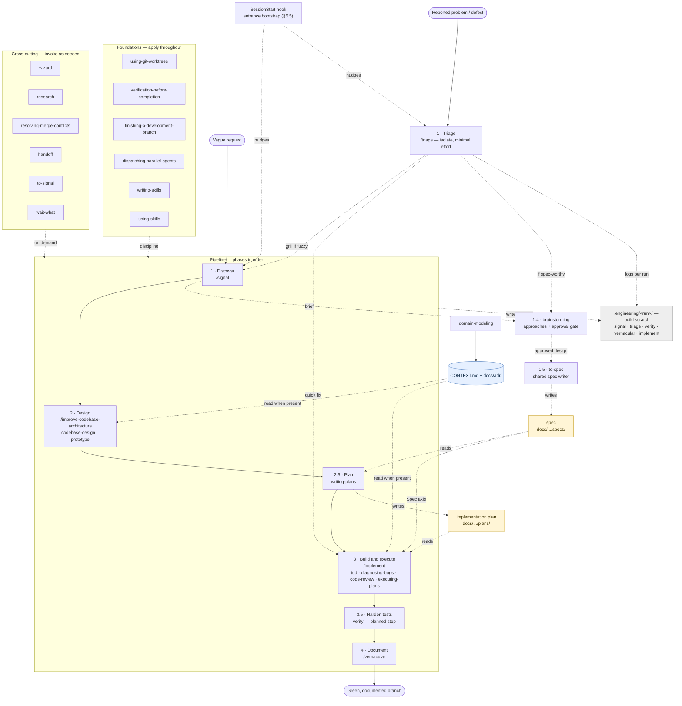

# Engineering plugin — design spec

**Date:** 2026-08-21
**Author:** Andrew Leach
**Status:** Approved design, ready for implementation plan
**Worktree/branch:** `.claude/worktrees/engineering-plugin` on `worktree-engineering-plugin`

## 1. Goal

Assemble a single `engineering` plugin in the `dashworthy` marketplace that is a full
software-development pipeline: discovery → design → build → test-hardening → documentation,
plus cross-cutting utilities. It is built by absorbing the three existing dashworthy plugins
(`signal`, `verity`, `vernacular`) and **reimplementing** a curated subset of the *techniques*
demonstrated in Matt Pocock's skills (https://github.com/mattpocock/skills) as original
dashworthy works — original text and structure, nothing copied (see §9).

The larger objective this serves: **eventually remove the `superpowers` plugin.** This spec
delivers a full replacement of its process skills — stand-ins for its implementation skills (TDD,
debugging, code review), its planning + execution pair, its design-dialogue (`brainstorming`,
§6.6), **and** its connective tissue (worktrees, finishing-branch, verification, parallel
dispatch, skill-writing, skill-discovery — §6.5) — plus net-new capability (discovery, triage,
test-hardening, docs-hardening, architecture).

## 2. Context

### 2.1 The marketplace today

`dashworthy` (repo: `dashworthy/development-skills`, MIT) publishes three self-contained,
single-purpose plugins, each a *pipeline* of several skills, not a single tool:

- **signal** — discovery: interrogate a vague request into hard requirements, expand scope,
  sequence into a dependency-ordered brief. 4 skills + `/signal`. Produces a brief and stops.
- **verity** — diff-scoped test hardening. 4 skills + a session-start hook. Never touches
  application code.
- **vernacular** — diff-scoped documentation hardening. 3 skills + `/vernacular` +
  `reconcile.py` + a test suite. Proves code and annotations came out byte-identical.

House style, to be preserved: narrow guarantee per unit, an explicit account of what each
unit does **not** guarantee, conductor + dispatched-subagent architecture, file-based
artifacts (no external tracker), README with a process-flow diagram.

### 2.2 Matt Pocock's engineering skills

18 skills, split user-invoked / model-invoked. They are a flat toolbox bound by two shared
substrates:

1. **Knowledge substrate** — `CONTEXT.md` (domain glossary) + `docs/adr/` (decision records).
   Threads through `tdd`, `code-review`, `codebase-design`, `improve-codebase-architecture`,
   `domain-modeling`. Self-contained (just files in the repo). **We adopt this.**
2. **Workflow substrate** — an issue tracker + triage labels, seeded by
   `setup-matt-pocock-skills`. Threads through the planning chain
   (`to-spec`/`to-tickets`/`wayfinder`) and `code-review`'s spec lookup. Heavy external
   coupling, contrary to dashworthy's file-based philosophy. **We reject this**; where a skill
   depends on it, we either drop the skill (its value is already covered by `signal`) or
   rewire it to file-based sources.

## 3. Decisions (locked)

| # | Decision | Rationale |
|---|---|---|
| D1 | One `engineering` plugin holding the whole pipeline | User chose a single umbrella plugin; the SDLC phases make it coherent despite being large |
| D2 | Absorb `signal`, `vernacular`, **and** `verity` into it | They are the discovery / documentation / test-hardening phases of the same pipeline |
| D3 | Marketplace collapses to a single plugin | Consequence of D1+D2; `verity` folded in per explicit choice |
| D4 | Curate; build only what adds capability and fits the file-based philosophy | "Works well with existing skills" = curation, not bulk import |
| D5 | Adopt `CONTEXT.md` + `docs/adr/` as a dashworthy convention (via `domain-modeling`) | It is the connective tissue that makes the design/build skills cohere; self-contained |
| D6 | Reject tracker coupling; everything file-based | Matches dashworthy philosophy; `signal` already owns the discovery/spec front |
| D7 | User-invoked skills become `/commands` | User's explicit rule |
| D8 | Every skill is dashworthy's **own original** work; Matt's skills and `superpowers` are inspiration only. No copying, no attribution, no NOTICE (§9) | User directive: "make these entirely my own" |
| D9 | Plugin name: `engineering` | Clearest umbrella label; deliberately breaks the evocative-single-word pattern (signal/verity/vernacular) because this is the meta-plugin |
| D10 | Deprecate standalone `signal`/`vernacular`/`verity` marketplace entries with a README redirect | Clean documented break; existing installs keep working until reinstall |
| D11 | Author `superpowers`' connective tissue **in this spec** (worktrees, finishing-branch, verification, parallel-dispatch, skill-writing, skill-discovery — §6.5) | User directive: replace all of superpowers' connective tissue now, not later. (With `brainstorming` added in D19, every superpowers process skill is now authored) |
| D12 | Planning + execution authored **in superpowers style**, in this spec (`writing-plans`, `executing-plans` → `/implement`); Matt's tracker planning chain dropped | User directive; closes the planning gap without tracker coupling |
| D13 | Two file tiers: Tier-1 specs/plans → `docs/dashworthy/engineering/{specs,plans}` (committed); Tier-2 build files → `.engineering/<run>/<name>/` (gitignored, run-first) | User directive; separates durable artifacts from runtime scratch |
| D14 | **Ship functional names this pass.** The signal/verity/vernacular artisanal theme (proposed map, §5.4) is deferred to a later cohesion pass. `to-signal` keeps its (explicitly chosen) name | User directive: keep functional for now |
| D15 | **Invert the hook model.** A `SessionStart` hook injects an *entrance bootstrap* (superpowers-style) that surfaces `using-skills` + routes to `/signal` or `/triage` before building (§5.5). Verity's own session-start hook is **retired**; test-hardening becomes a **planned step** (`writing-plans` bakes it in, `executing-plans` runs it) plus a **finish-time safety net** in `finishing-a-development-branch` | User directive: call signal like superpowers does; tie verity to the plan, not a session-start hook |
| D16 | **Second entrance `triage`** (`/triage`, §6.2). A problem-first door alongside `signal`: define a problem, isolate it with **minimal effort**, verify/reproduce it, then take the smallest next step — quick fix (`diagnosing-bugs`), grill (hand to `signal`), or spec it (`to-spec` → `writing-plans`). Establishes its own run and logs to `.engineering/<run>/triage/`. File-based reframe of Matt's tracker `triage` (flips its Skip verdict) | User directive: a separate `/triage` entrance for problem isolation |
| D17 | **Shared `to-spec` skill** (§6.2) is the **single writer of Tier-1 specs** to `docs/dashworthy/engineering/specs/`. Both `signal` (post-discovery) and `triage` (when spec-worthy) delegate to it, so every entrance yields one spec format. Flips Matt's `to-spec` Skip → Author (file-based, no tracker). Resolves the §5.1 brief-seam | User directive: a `to-spec` skill both signal and triage use to create the spec doc |
| D18 | **Skills stay flat on disk** (platform constraint: plugin `skills/` is scanned one level deep — *"Skills cannot be nested in category subdirectories"*). Process grouping is realized by (a) names that cluster by process, (b) a grouped `skills/README.md` index, (c) a `[Group]` tag opening each skill's `description`, (d) the grouped view in §7 — **not** filesystem subfolders | User directive: group skills by process where they are tightly tied to one; done within the platform's limits |
| D19 | **Author a design-dialogue phase `brainstorming`** (Phase 1.4, §6.6) between the entrances and `to-spec`: weigh 2–3 approaches, shape the design section by section, hold the **approval gate** before any spec/plan. Resolves G8; completes the `superpowers` process-skill replacement | User question answered yes: there is value in a brainstorming phase between signal/triage and the spec |

## 4. Curation ledger — every Matt skill, in or out

**Author** = build an original dashworthy skill for this capability, with Matt's skill as
inspiration only (§9). **Skip** = not building it. The "Matt skill" column names the inspiration,
not a source to copy.

| Matt skill | Verdict | Reason |
|---|---|---|
| `codebase-design` | **Author** (model) | Novel deep-module vocabulary; foundation for `improve-codebase-architecture` |
| `improve-codebase-architecture` | **Author** (command) | Novel; `disable-model-invocation: true` → `/improve-codebase-architecture` |
| `prototype` | **Author** (model) | Novel; neutralize tracker "issue" references |
| `tdd` | **Author** (model) | Direct replacement for `superpowers` test-driven-development |
| `diagnosing-bugs` | **Author** (model) | Direct replacement for `superpowers` systematic-debugging |
| `code-review` | **Author** (model) | Direct replacement for `superpowers` requesting/receiving-code-review; rewire spec-source to file-based |
| `domain-modeling` | **Author** (model) | Owns the CONTEXT.md/ADR substrate (D5) |
| `wizard` | **Author** (model + command) | Novel; add `/wizard` since users ask for one by name |
| `research` | **Author** (model) | Novel; background-agent fact-gathering |
| `resolving-merge-conflicts` | **Author** (model) | Novel; git-only, clean |
| `handoff` (productivity) | **Author** (command) | Compact a conversation into a handoff doc; `disable-model-invocation: true` → `/handoff` |
| `to-signal` (productivity) | **Author** (command) | `/to-signal` — turn a decision you can't answer into a questionnaire for someone else, whose answers feed back into discovery (hence the name); inspiration: Matt's `to-questionnaire` |
| `wait-what` (productivity) | **Author** (command) | Comms repair — "that last message didn't land, re-pitch it"; reads `CONTEXT.md`/`CONTEXT-MAP.md`; → `/wait-what` |
| `to-spec` | **Author** (model) | Reframed file-based (D17): the shared single writer of Tier-1 specs to `docs/.../specs/`, used by both `signal` and `triage`. Matt's tracker coupling is dropped |
| `triage` | **Author** (model + command) | Reframed file-based (D16): a problem-isolation entrance, `/triage`. Matt's tracker/label state-machine is dropped; disposition is logged to `.engineering/<run>/triage/` |
| `wayfinder` | **Skip** | HEAVY tracker coupling; a tracker methodology, not worth it file-based |
| `to-tickets` | **Skip** | HEAVY tracker coupling; planning value overlaps `signal`'s `sequencing-requirements` |
| `implement` | **Skip — superseded** | Replaced by an authored, superpowers-inspired `executing-plans` (+ `/implement`), paired with an authored `writing-plans`. See §4 note and §6.4 |
| `grill-with-docs` | **Skip** | Interactive grilling loop; its role inside `improve-codebase-architecture` is replaced by `codebase-design` + `domain-modeling` |
| `ask-matt` | **Skip** | Personal routing skill referencing Matt's own system |
| `setup-matt-pocock-skills` | **Skip** | Seeds the tracker substrate we reject |

> Note on `implement` (resolved): rather than adopt Matt's `implement`, this plugin **authors a
> planning + execution pair, inspired by superpowers** — a `writing-plans` skill (spec → ordered
> plan with review checkpoints) and an `executing-plans` skill (execute a plan against `/tdd` +
> `/code-review`, with review gates and optional subagent-driven mode), surfaced as
> `/implement`. This is the user's directed choice ("for planning and implement, follow more of
> the superpowers style"). It closes the planning gap (former G1) inside this spec and removes
> the stranding concern. Matt's tracker-coupled `to-tickets`/`wayfinder` and his `implement` are
> skipped in favor of it; his `to-spec` is not skipped but **reimagined file-based** as the shared
> spec writer (D17, §6.2). Both are **original works, nothing copied** — see §9.

## 5. Target architecture — the pipeline

| Phase | Skills | Command(s) |
|---|---|---|
| **1 · Discover** (entrance) | `conducting-discovery`, `interrogating-requirements`, `expanding-scope`, `sequencing-requirements` (signal); `domain-modeling`; → `to-spec` | `/signal` |
| **1 · Triage** (alt entrance) | `triage` (problem isolation, minimal effort; may grill via `signal`, quick-fix via `diagnosing-bugs`, or → design dialogue) | `/triage` |
| **1.4 · Design dialogue** | `brainstorming` (weigh 2–3 approaches, shape the design section by section, **approval gate** before any spec/plan) | — |
| **1.5 · Spec** | `to-spec` (shared single writer of Tier-1 specs; renders the approved design) | — |
| **2 · Design** | `codebase-design`, `improve-codebase-architecture`, `prototype` | `/improve-codebase-architecture` |
| **2.5 · Plan** | `writing-plans` (authored, superpowers-style) | — |
| **3 · Build & execute** | `tdd`, `diagnosing-bugs`, `code-review`, `executing-plans` (authored, superpowers-style) | `/implement` |
| **3.5 · Harden tests** | `conducting-test-hardening`, `auditing-test-gaps`, `verifying-test-integrity`, `writing-tests-from-brief` (verity) | — (planned step, §6.4; finish-time net, §6.5) |
| **4 · Document** | `clarifying-docblocks`, `rewriting-docblock-prose`, `verifying-docblock-claims` (vernacular) | `/vernacular` |
| **Cross-cutting** | `wizard`, `research`, `resolving-merge-conflicts`, `handoff`, `to-signal`, `wait-what` | `/wizard`, `/handoff`, `/to-signal`, `/wait-what` |
| **Foundations** (workflow discipline) | `using-git-worktrees`, `finishing-a-development-branch`, `verification-before-completion`, `dispatching-parallel-agents`, `writing-skills`, `using-skills` | — |

Shared knowledge layer across phases 2–4: `CONTEXT.md` + `docs/adr/`, seeded and maintained by
`domain-modeling`, read (never required) by `tdd`, `code-review`, `codebase-design`,
`improve-codebase-architecture`.

Unit count: ~32 skills (signal 4 + verity 4 + vernacular 3 + Matt-inspired engineering 12 —
now incl. `triage` + `to-spec` — + 2 planning/execution + 1 design-dialogue (`brainstorming`) +
6 workflow foundations) + 3 productivity commands (handoff, to-signal, wait-what — realized as
pure commands, see §5.2).
Commands total: 9 (`/signal`, `/triage`, `/vernacular`, `/improve-codebase-architecture`,
`/implement`, `/wizard`, `/handoff`, `/to-signal`, `/wait-what`). Hook: 1 (`SessionStart`
entrance bootstrap → `/signal` or `/triage`, §5.5). This is a large plugin — the trade for it
being a near-complete
`superpowers` replacement plus the design/discovery additions.

### End-to-end flow

Two entrances open the work — **Discover** (`/signal`, feature/greenfield) and **Triage**
(`/triage`, problem isolation) — and both pass through **`brainstorming`** (the design-dialogue
approval gate, §6.6) into **`to-spec`**, the single writer of the Tier-1 spec. From there the
phases run in order; the **Foundations** wrap every phase (worktree
at the start, verification/finishing at the end) and the **Cross-cutting** skills are invoked on
demand at any point. Solid arrows are the phase sequence; dashed arrows are artifact reads/writes
or hand-offs. Tier-1 documents (yellow) are committed under `docs/dashworthy/engineering/`; the
knowledge store (blue) is `CONTEXT.md` + `docs/adr/`; Tier-2 scratch (grey) is gitignored
`.engineering/<run>/`.



### 5.1 File-artifact conventions

Generated files fall in **two tiers**, by durability and audience:

**Tier 1 — durable spec & plan documents** (human-facing, committed). Mirrors `superpowers`'
spec/plan convention, namespaced under marketplace + plugin so it never collides with another
tool's artifacts:

| Artifact | Path | Produced by | Consumed by |
|---|---|---|---|
| Spec | `docs/dashworthy/engineering/specs/` | **`to-spec`** (the sole writer; fed by `signal` or `triage`) | `writing-plans`, `code-review` (Spec axis), humans |
| Implementation plan | `docs/dashworthy/engineering/plans/` | `writing-plans` | `executing-plans` / `/implement`, humans |
| Domain glossary | `CONTEXT.md` (repo root) | `domain-modeling` | design/build skills |
| Decision records | `docs/adr/` | `domain-modeling` | design/build skills |

Naming within `specs/`/`plans/` follows `YYYY-MM-DD-<topic>.md` (this design doc itself lives
at `docs/dashworthy/engineering/specs/2026-08-21-engineering-plugin-design.md`).

**Tier 2 — build/working files** (per-phase scratch, run scaffolding, receipts, internal
briefs — everything that is not a spec/plan document). All generated under a single gitignored
root, **run-first** so every phase of one run is co-located (§5.3), replacing today's scattered
`.signal/`, `.verity/`, `.vernacular/`:

| Was | Becomes | Holds |
|---|---|---|
| `.signal/runs/<date>-<slug>/` | `.engineering/<run>/signal/` | `open-threads.md`, `00-request.md`, run scaffolding |
| — (new) | `.engineering/<run>/triage/` | problem statement, reproduction notes, isolation findings, disposition |
| `.verity/`, `.verity/briefs/` | `.engineering/<run>/verity/` (+ `briefs/`) | config, test-hardening working briefs |
| `.vernacular/` | `.engineering/<run>/vernacular/` | rewrite receipts, reconcile temp |

Consequences:

- **`.engineering/` is gitignored** (add to `.gitignore` during the build) — it is per-project
  runtime output, never committed, and never part of the plugin package.
- **The spec/plan seam (resolved by `to-spec`, D17).** The **spec** is the one Tier-1
  discovery/triage deliverable, and **`to-spec` is its sole writer** →
  `docs/dashworthy/engineering/specs/`. Whatever an entrance accumulates first — `signal`'s
  discovery brief, `triage`'s isolation findings — stays Tier-2 working material
  (`.engineering/<run>/{signal,triage}/`); the entrance then hands that material to `to-spec`,
  which renders the committed spec. One writer, one format, regardless of entrance.
- **`code-review` rewiring** (§6.2) reads its Spec-axis source from
  `docs/dashworthy/engineering/specs/` (plus user-supplied paths), replacing the tracker lookup.
- Redirecting these working paths is part of each plugin's absorption (§6.1), and touches
  `vernacular`'s `tests/` (which reference `.vernacular`).

### 5.2 Command realization rule

Two ways a user-invoked (D7) capability is realized, chosen by shape:

- **Skill + thin `/command` wrapper** — when the capability has reference/subfiles, or it
  dispatches other skills. Applies to `signal`, `triage` (it dispatches `signal` /
  `diagnosing-bugs` / `to-spec`), `vernacular`, `improve-codebase-architecture`, and
  `executing-plans` (→ `/implement`). The `/command` is a few lines that invoke the skill.
- **Pure `commands/<name>.md`** — when the capability is a self-contained single-shot with no
  subfiles and nothing dispatches it. Applies to `handoff`, `to-signal`, `wait-what`.
  The whole workflow lives in the command file; no skill entry.

### 5.3 Run context (the `<run>` key)

Tier-2 is organized by *run* so one piece of work's artifacts sit together and a whole run's
scratch can be inspected or discarded at once. A run needs an id shared across phases that are
otherwise invoked independently:

- **`<run>` format:** `<YYYY-MM-DD>-<slug>`, where the slug is a short kebab name for the work
  (derived from the request or branch). This reuses `signal`'s existing run-naming, hoisted to
  the top level so every phase shares it.
- **Establishing / reusing a run:** the first phase to write in a working session creates the
  run and records it in a gitignored pointer, `.engineering/.current-run` (holds the active
  `<run>`). Later phases read the pointer and write under the same `<run>`. Either entrance can
  be first — `signal` for a feature, `triage` for a problem — so both create-or-read the pointer
  the same way (D16).
- **Standalone invocation** (e.g. `/vernacular` with no prior `signal` run): if the pointer is
  absent, the skill starts a fresh run — its own `<YYYY-MM-DD>-<slug>` — and sets the pointer,
  so any subsequent phase joins it.
- **Correspondence, not coupling:** a run's slug will usually match the Tier-1 spec topic
  (`docs/.../specs/<same-date>-<slug>.md`), but the tiers stay separate — Tier-1 is committed
  and human-facing, Tier-2 is gitignored runtime scratch.
- **New shared mechanism** — see gap G7. The run pointer is the one piece of cross-phase state
  this plugin introduces; every absorbed skill must read/create it the same way.

### 5.4 Naming (artisanal theme — DEFERRED)

**Deferred (D14): this pass ships functional names.** The map below is kept as a future cohesion
pass. The marketplace's existing skills — `signal`, `verity`, `vernacular` — are evocative,
mostly single, Latinate quality-nouns, and new skills could later adopt that register where it
makes sense, so the plugin reads as one handcrafted set. Guard: keep conventional names where a
themed one would hurt discoverability (`tdd`, `code-review`).

Proposed map (future — not applied this pass; `to-signal` is the one already-chosen exception):

| Capability | Proposed name | Why |
|---|---|---|
| brainstorming | **charrette** | an intensive collaborative design session |
| domain-modeling | **lexicon** | owns `CONTEXT.md` — the project's vocabulary |
| codebase-design | **profundity** | deep-module vocabulary (depth, leverage, seams) |
| improve-codebase-architecture | **renovation** (`/renovate`) | finds shallow modules and deepens them |
| prototype | **maquette** | a small throwaway model |
| writing-plans | **prospectus** | a document laying out the planned work |
| executing-plans | **cadence** (`/implement`) | disciplined execution rhythm |
| diagnosing-bugs | **etiology** | the study of causes |
| research | **provenance** | primary-source discipline |
| resolving-merge-conflicts | **confluence** | reconciling streams into one |
| wizard | **cicerone** (`/cicerone`) | a guide who conducts a human through steps |
| handoff | **dossier** (`/dossier`) | a file handed to the next session |
| wait-what | **gloss** (`/gloss`) | a plain-language restatement |
| to-signal | `to-signal` | already themed (feeds `signal`) |
| tdd | `tdd` | strong convention — keep |
| code-review | `code-review` | strong convention — keep |

signal/verity/vernacular and their internal sub-skills keep their current names. Elsewhere in
this spec, capabilities are referred to by their functional names for clarity; §5.4 is the
authority on the shipped skill id.

### 5.5 Session-start hook — entrance bootstrap (D15, D16)

Mirrors how `superpowers` surfaces its process skills at the top of a session. A single
`SessionStart` hook (`hooks/hooks.json` + `hooks/session-start.sh`) injects a short bootstrap
that:

- points at the `using-skills` foundation (§6.5) — *invoke the right skill before acting*; and
- **routes to the right entrance** before anyone starts building:
  - a feature or a vague ask → `/signal` (discovery → brief);
  - a reported bug or defect → `/triage` (isolate with minimal effort).

This is the engineering analog of superpowers' "brainstorm before building" bootstrap, widened to
cover both front doors. It **injects guidance only — it never blocks**; the `using-skills`
discipline does the enforcing. It replaces verity's old session-start reminder, which is retired:
verity is now triggered by the plan and at finish time (§6.1/§6.4/§6.5), not by a session-start
hook.

**One hook, by choice — not by limit** (verified against the plugin docs). A plugin may declare
many hooks — multiple events, matchers, and actions in `hooks.json`. This plugin needs only the
single `SessionStart` bootstrap, and it carries *both* entrances, so `/triage` needs no hook of
its own. If a later event-driven trigger is ever wanted, it is added to the same `hooks.json`.

### 5.6 Grouping the `skills/` directory (D18)

The user's intent: when several skills are tightly tied to one process, make that legible in
`skills/`. The platform, however, **does not support subdirectory grouping** — Claude Code scans
a plugin's `skills/` exactly one level deep and *"Skills cannot be nested in category
subdirectories."* Moving `conducting-discovery` to `skills/discovery/conducting-discovery/` would
make it undiscoverable. So the directories stay flat; the grouping is expressed four other ways:

1. **Names that cluster.** The process-bound clusters already share a noun, so they sort and read
   together: signal's discovery/requirements verbs; verity's `*-test-*`; vernacular's
   `*-docblock*`; the foundations' workflow-discipline verbs. New process skills follow suit.
2. **A `[Group]` tag opening each `description`.** Every process-tied skill's frontmatter
   `description` starts with a bracketed group label — `[Discovery]`, `[Triage]`, `[Test
   hardening]`, `[Docs]`, `[Design]`, `[Build]`, `[Planning]`, `[Foundation]`. This is visible in
   the skill list and steers model-invocation matching, at zero structural cost.
3. **A grouped `skills/README.md` index** — a table listing every skill under its process group,
   the human's map of the flat directory.
4. **The grouped view in §7** — the directory layout keeps its brace-grouped annotations.

Cross-cutting/general skills (`wizard`, `research`, `resolving-merge-conflicts`) carry no group
tag — they are not tied to one process, which is itself the signal.

## 6. Adaptation notes, per source

### 6.1 Absorbed dashworthy plugins (behavior-preserving move)

- **signal → engineering.** Move 4 skills + `commands/signal.md`. Re-namespace every internal
  reference from `signal:` to `engineering:` (the `/signal` command dispatches
  `signal:conducting-discovery`; the conductor dispatches the other three). **Spec-writing now
  delegates to `to-spec` (D17):** signal's discovery brief becomes Tier-2 working material under
  `.engineering/<run>/signal/`, and its final step hands that brief to `to-spec`, which writes the
  committed Tier-1 spec to `docs/dashworthy/engineering/specs/` — signal no longer writes the
  spec file itself. **Tier-2:** run scaffolding + brief live under `.engineering/<run>/signal/`
  (§5.1, §5.3); signal, as the usual first phase, establishes `<run>` and writes the
  `.engineering/.current-run` pointer. Updates the run-dir references in `conducting-discovery`
  and the README/command prose.
- **vernacular → engineering.** Move 3 skills + `commands/vernacular.md` + `scripts/reconcile.py`
  + `tests/` (`e2e.sh`, `reconcile.sh`, `validate.sh`). Re-namespace. **Tier-2:** redirect
  `.vernacular/` → `.engineering/<run>/vernacular/` in the skills, the receipt schema, and the
  test suite (`e2e.sh` and others reference `.vernacular`); read/create the run pointer (§5.3).
  Keep the reconcile test suite green — it is the plugin's proof harness.
- **verity → engineering.** Move the 4 skills + the `conducting-test-hardening/references/*`.
  Re-namespace. **Tier-2:** redirect `.verity/` and `.verity/briefs/` →
  `.engineering/<run>/verity/` (config + working briefs) across the skills and `brief-schema.md`;
  read/create the run pointer (§5.3). **Retire verity's session-start hook** (D15): its "harden
  once implementation is done" trigger no longer rides a session-start reminder. Test-hardening
  becomes a **planned step** — `writing-plans` bakes a Phase-3.5 hardening task into every plan
  and `executing-plans` runs it (§6.4) — plus a **finish-time safety net** in
  `finishing-a-development-branch` (§6.5) so plan-less, ad-hoc work is still hardened before a
  branch is finished. The plugin's one `SessionStart` hook is now the entrance bootstrap (§5.5),
  not verity's reminder.

### 6.2 Original skills, inspired by Matt's (§9)

Each bullet names the inspiration and the pieces to build. Every file is **authored fresh** in
dashworthy voice — original text and structure, nothing copied (§9). "author `SKILL.md` + `X.md`"
means write dashworthy's own SKILL and companion files covering the same technique.

- **to-spec** — author `SKILL.md` + `SPEC-FORMAT.md` template. The **single writer of Tier-1
  specs** (D17): given an entrance's accumulated material (a `signal` discovery brief or a
  `triage` isolation record), render the standard spec document to
  `docs/dashworthy/engineering/specs/<YYYY-MM-DD>-<topic>.md`. One format for every entrance;
  consumed by `writing-plans` and `code-review`. File-based — Matt's `to-spec` was tracker-coupled
  (issues/tickets); this is a clean reimplementation (§9). Model-invoked; no command.
- **triage** — author `SKILL.md` + `references/` (a reproduction/isolation checklist and the
  ready-brief shape). The **problem-isolation entrance** (D16), `/triage` (skill + wrapper, §5.2):
  the maintainer describes a defect; triage establishes/joins a run (§5.3) and logs to
  `.engineering/<run>/triage/`, then works for **minimal effort**:
  1. **Verify / reproduce** the claim from the report before doing anything — confirmed (with the
     failing path), not-reproducible, or under-specified.
  2. **Isolate** the cause by domain concept (reading `CONTEXT.md`/ADRs when present); run a
     **redundancy check** (is the wanted behaviour already implemented? → record and stop) and a
     lightweight **prior-rejection** check.
  3. **Take the smallest next step:** a **quick fix** hands to `diagnosing-bugs`; an
     **under-specified / actually-a-feature** problem hands to `signal` for grilling
     (interrogation); a **spec-worthy** fix hands to `to-spec` → `writing-plans`; a
     **wontfix/already-done** outcome is recorded and closed.
  Everything is file-based — no tracker, no labels, no PR state-machine (all dropped from Matt's
  tracker-coupled `triage`, §9). Disposition is written to `.engineering/<run>/triage/`.

  **When `triage` writes a spec (vs. not).** The default is *minimal effort* — most triaged
  problems resolve without a spec. `triage` routes by the case below; a spec is written only when
  the fix warrants planning:

  | Case | Route | Spec? |
  |---|---|---|
  | Cause obvious, fix small and localized, low risk | quick fix → `diagnosing-bugs` | **No** |
  | Not reproducible, already implemented, or out of scope | record disposition + close | **No** |
  | Under-specified, or really a feature request in disguise | grill → `signal` → `brainstorming` → `to-spec` | **Yes** (feature path) |
  | Real fix but non-trivial — several sites, a design choice, risky/cross-cutting, needs sequencing, or will be handed to an AFK agent | `brainstorming` → `to-spec` → `writing-plans` | **Yes** |

  Rule of thumb: **spec when the fix needs a plan or another party will execute it; skip the spec
  when a single obvious change closes it.** The spec-worthy rows pass through `brainstorming`
  (Phase 1.4) so the fix's approach is weighed and approved before planning.
- **codebase-design** — author `SKILL.md` + `DEEPENING.md` + `DESIGN-IT-TWICE.md` (deep-module
  vocabulary). Foundation for the design phase; build first.
- **domain-modeling** — author `SKILL.md` + dashworthy `CONTEXT-FORMAT.md` / `ADR-FORMAT.md`
  templates (original; see G3). Define the boundary vs `signal`: `signal` explores *what to
  build*; `domain-modeling` crystallizes *how we name it* and owns `CONTEXT.md`.
- **tdd** — author `SKILL.md` + `tests.md` + `mocking.md`. Keep the optional `CONTEXT.md`
  reference. Document the boundary vs verity: `tdd` is the red-green build loop *during*
  implementation; verity is diff-scoped hardening *after*. They compose.
- **diagnosing-bugs** — author `SKILL.md` + `scripts/hitl-loop.template.sh`. Clean; no tracker.
- **code-review** — author `SKILL.md`. **Rewire the spec source**: replace the
  `docs/agents/issue-tracker.md` lookup + "run `/setup-matt-pocock-skills`" prompt with
  file-based spec discovery (a `signal` brief in `docs/dashworthy/engineering/specs/`, or a
  user-supplied path — see §5.1). Keep the
  two-axis (Standards + Spec) structure and parallel sub-agents. Note coexistence with the
  user's separately-installed review plugins (different marketplaces; no conflict, but the
  `code-review` name will appear twice in the skill list during the superpowers-removal
  transition — acceptable).
- **improve-codebase-architecture** — author `SKILL.md` + `HTML-REPORT.md`. Convert to a
  `/improve-codebase-architecture` command (it is `disable-model-invocation: true`). **Sever the
  `grill-with-docs` dependency**: replace the grilling loop with invocations of `codebase-design`
  (interface exploration) and `domain-modeling` (CONTEXT.md/ADR updates). Keep the self-contained
  HTML report (Tailwind + Mermaid via CDN, written to a temp dir).
- **prototype** — author `SKILL.md` + `LOGIC.md` + `UI.md`. Neutralize tracker references:
  "document the validated decision in the issue" → "document it in the brief/spec" (file-based).
- **wizard** — author `SKILL.md` + `template.sh` (into `scripts/wizard-template.sh`). Add a
  `/wizard` command that invokes the skill. Note the `gh` CLI runtime dependency.
- **research** — author `SKILL.md`. Background-agent dispatch; writes a cited Markdown file
  following repo conventions. Clean.
- **resolving-merge-conflicts** — author `SKILL.md`. git-only; clean.

### 6.3 Productivity commands (original; realized as pure commands, §5.2)

Three original commands, inspired by Matt's `skills/productivity/` (§9). Each is user-invoked,
so a pure `commands/<name>.md` (§5.2).

- **handoff → `/handoff`** — compact the conversation into a handoff document for a successor
  session. Keep the `argument-hint` ("What will the next session be used for?"). Keep writing to
  the OS temp dir (ephemeral cross-session context; deliberately not a repo artifact), and keep
  the "suggested skills" section — but update those suggestions to reference `engineering:`
  skills. Keep secret redaction. Reference existing artifacts under
  `docs/dashworthy/engineering/specs|plans/`, `CONTEXT.md`, `docs/adr/` rather than duplicating.
- **to-signal → `/to-signal`** — turn a decision you can't answer into a questionnaire for
  someone else; writes `to-signal-<slug>.md` in the current directory. Named for its pairing with
  `signal`: when discovery surfaces a question the user cannot answer, `to-signal` externalizes
  it and the answers feed back into discovery.
- **wait-what → `/wait-what`** — comms repair. Reads `CONTEXT.md`/`CONTEXT-MAP.md` (our adopted
  substrate, D5), writes nothing. Keep the ASD-STE100 Simplified-Technical-English framing.

### 6.4 Authored planning + execution (superpowers as inspiration)

Per the user's directive ("for planning and implement, follow more of the superpowers style"),
these two are **authored fresh, inspired by superpowers** — original text and structure, nothing
copied (§9). They replace Matt's skipped `to-tickets`/`wayfinder`/`implement` (his `to-spec` is
authored file-based instead, D17/§6.2).

- **writing-plans** (Phase 2.5, model-invoked). Turns a spec/brief in
  `docs/dashworthy/engineering/specs/` into an ordered implementation plan written to
  `docs/dashworthy/engineering/plans/<YYYY-MM-DD>-<topic>.md` — steps sequenced so nothing
  precedes what it depends on, with review checkpoints and explicit TDD integration points, and
  **a closing test-hardening task** (Phase 3.5) that invokes `conducting-test-hardening` so
  verity runs as a planned step, not a session-start reminder (D15). Reads `CONTEXT.md`/ADRs when
  present. Style model: `superpowers:writing-plans`.
- **executing-plans** (Phase 3, skill + `/implement`). Executes a plan from
  `docs/dashworthy/engineering/plans/` task by task, each task driven through `engineering:tdd`
  and gated by `engineering:code-review`, pausing at the plan's review checkpoints, and running
  the plan's closing test-hardening task through `conducting-test-hardening` when reached (D15).
  Supports an optional subagent-driven mode for independent tasks (style model:
  `superpowers:executing-plans` + `superpowers:subagent-driven-development`). Working state
  under `.engineering/<run>/implement/` (§5.3).
- **Namespacing avoids collision.** As `engineering:writing-plans` / `engineering:executing-plans`
  they coexist with the `superpowers:` originals during the transition (G5).

### 6.5 Authored workflow foundations (superpowers as inspiration)

The six cross-cutting workflow disciplines that make `superpowers` cohere. Authored original,
inspired by superpowers' approach (§9) — original text, nothing copied. Model-invoked (they fire
by discipline, not by command); no new commands.

- **using-git-worktrees** — ensure work happens in an isolated workspace; prefer the harness's
  native worktree tool (e.g. `EnterWorktree`), fall back to `git worktree`. Detect existing
  isolation first.
- **finishing-a-development-branch** — when work is complete and green, present structured
  options for integrating it (merge / PR / cleanup) and carry out the choice. **Verity safety net
  (D15):** if the branch's implementation was never hardened (no plan, or the plan's hardening
  task was skipped), prompt to run `conducting-test-hardening` before finishing — this is where
  verity's always-on coverage lives now that its session-start hook is retired.
- **verification-before-completion** — before claiming done/fixed/passing, run the verification
  commands and confirm output; evidence before assertions. (Complements verity, which hardens
  the tests themselves.)
- **dispatching-parallel-agents** — a general primitive for fanning out 2+ independent tasks
  with no shared state; distinct from `executing-plans`' plan-scoped subagent mode.
- **writing-skills** — author, edit, and verify skills (the meta-skill for growing this plugin);
  makes the plugin self-extending as it diverges (§9).
- **using-skills** — the skill-discovery discipline: how to find and invoke the right skill
  before acting. This is dashworthy's own equivalent of `superpowers`' bootstrap meta-skill;
  named `using-skills` (not `using-superpowers`) precisely because it is not superpowers.

> Residual note: `superpowers`' `brainstorming` (approval-gated design dialogue) is **not** one
> of these six foundations — it is a pipeline phase, authored separately as `engineering:brainstorming`
> (Phase 1.4, §6.6, D19). `subagent-driven-development` is covered by `executing-plans`' subagent
> mode (§6.4). With these, every `superpowers` process skill has a dashworthy equivalent.

### 6.6 Authored design dialogue — `brainstorming` (superpowers as inspiration)

Phase 1.4, the collaborative design-shaping step between the entrances and `to-spec` (D19).
Authored fresh, inspired by `superpowers:brainstorming` — original text and structure, nothing
copied (§9). Model-invoked; no command (it fires when a piece of work is being shaped into a
design, reachable from either entrance and nudged by the bootstrap, §5.5).

- **Where it sits.** `signal` gathers requirements (a brief) and stops; `triage` isolates a
  problem; `brainstorming` takes that material and shapes a **design** with the human, then hands
  the approved design to `to-spec`, which writes the spec. It is the gate between *what* and
  *how*.
- **What it does.** Explore the project context; propose **2–3 approaches** with trade-offs and a
  recommendation; if the work is too large for one spec, **decompose** it into sub-projects and
  brainstorm the first; present the design **section by section**, taking incremental approval;
  hold a **hard gate** — no `writing-plans`, no build, until the human approves the design.
- **Boundaries (house style — narrow guarantees).**
  - vs `signal`: signal interrogates *what to build* (requirements); brainstorming weighs
    *how to build it* (approach) and owns the approval gate. Signal keeps its "brief and stops,
    does not design" guarantee.
  - vs `codebase-design` (Phase 2): that is technical module design *after* the spec, during
    implementation; brainstorming is product/approach design *before* the spec. Brainstorming may
    consult `CONTEXT.md`/ADRs but does not itself design internals.
  - vs `to-spec`: brainstorming produces the approved design through dialogue (the gate);
    `to-spec` serializes it (the writer).
- **Skippable for minimal-effort work.** A `triage` quick fix that needs no spec bypasses it (the
  diagram's `quick fix` edge). Anything that reaches a spec passes through it; for a trivial spec
  the dialogue is short, but the approach check and approval gate still run.
- **Transition overlap (G5).** Ships as `engineering:brainstorming` alongside
  `superpowers:brainstorming` until superpowers is removed; namespacing keeps them distinct.

## 7. Directory layout

```
engineering/
├── .claude-plugin/plugin.json
├── README.md                         pipeline overview + process diagram + non-guarantees
├── commands/
│   ├── signal.md
│   ├── triage.md                       problem-isolation entrance (§6.2)
│   ├── vernacular.md
│   ├── improve-codebase-architecture.md
│   ├── implement.md                  wrapper → executing-plans
│   ├── wizard.md
│   ├── handoff.md                    productivity (pure command, §5.2)
│   ├── to-signal.md           productivity (pure command, §5.2)
│   └── wait-what.md                  productivity (pure command, §5.2)
├── hooks/
│   ├── hooks.json
│   └── session-start.sh              entrance bootstrap → /signal | /triage (§5.5)
├── scripts/
│   ├── reconcile.py                  vernacular
│   ├── hitl-loop.template.sh         diagnosing-bugs
│   └── wizard-template.sh            wizard
├── tests/                            vernacular's proof harness
│   ├── e2e.sh
│   ├── reconcile.sh
│   └── validate.sh
└── skills/
    ├── README.md                     grouped skill index (D18)
    ├── conducting-discovery/         ┐
    ├── interrogating-requirements/   │ signal — [Discovery]
    ├── expanding-scope/              │
    ├── sequencing-requirements/      ┘
    ├── triage/                       [Triage] (+ references/; → /triage)
    ├── brainstorming/                [Design] (design-dialogue gate, §6.6)
    ├── to-spec/                      [Discovery] (+ SPEC-FORMAT.md; shared spec writer)
    ├── domain-modeling/
    ├── codebase-design/              (+ DEEPENING.md, DESIGN-IT-TWICE.md)
    ├── improve-codebase-architecture/(+ HTML-REPORT.md)
    ├── prototype/                    (+ LOGIC.md, UI.md)
    ├── tdd/                          (+ tests.md, mocking.md)
    ├── diagnosing-bugs/
    ├── code-review/
    ├── writing-plans/                (authored, superpowers-style)
    ├── executing-plans/              (authored, superpowers-style; → /implement)
    ├── conducting-test-hardening/    ┐
    ├── auditing-test-gaps/           │ verity (+ references/)
    ├── verifying-test-integrity/     │
    ├── writing-tests-from-brief/     ┘
    ├── clarifying-docblocks/         ┐
    ├── rewriting-docblock-prose/     │ vernacular (+ references/)
    ├── verifying-docblock-claims/    ┘
    ├── wizard/
    ├── research/
    ├── resolving-merge-conflicts/
    ├── using-git-worktrees/            ┐
    ├── finishing-a-development-branch/ │ workflow foundations
    ├── verification-before-completion/ │ (superpowers-inspired,
    ├── dispatching-parallel-agents/    │  authored original)
    ├── writing-skills/                 │
    └── using-skills/                   ┘
```

`docs/dashworthy/engineering/{specs,plans}/` (Tier-1) and `.engineering/<run>/…` (Tier-2) are
generated **in the user's project at runtime**, not shipped inside the plugin package — they do
not appear in the plugin directory above.

## 8. Marketplace changes + migration

- Rewrite `.claude-plugin/marketplace.json`: replace the three entries with a single
  `engineering` entry (name, description, version `0.1.0`, `source: ./engineering`, author).
- Root `README.md`: rewrite around the one pipeline plugin. Add a **Deprecation** section:
  > `signal`, `verity`, and `vernacular` are now phases of the `engineering` plugin. The old
  > install commands (`/plugin install signal@dashworthy`, etc.) are deprecated; install
  > `engineering@dashworthy` instead. Existing installs keep working until reinstall.
- Delete the old top-level `signal/`, `verity/`, `vernacular/` directories once their contents
  are absorbed and verified.

## 9. Originality (this is entirely dashworthy's own work)

**The goal is that every skill here is dashworthy's own.** Matt Pocock's skills and
`superpowers` are **inspiration** — reference points for how others solved the same problem —
not sources to be copied. What is protectable by copyright is *expression*, not the underlying
idea, method, or workflow; so dashworthy re-derives the method and writes it fresh.

- Repo stays MIT.
- **No attribution, no NOTICE, no credit lines.** Because nothing is copied, no MIT notice is
  owed and none is carried. There is no `engineering/NOTICE`.
- **Originality bar (what makes that sound):** each skill is a genuine independent expression —
  original text, original section structure, dashworthy voice and conventions. Not a paraphrase
  of Matt's wording, not a near-copy of his layout, not a reskinned superpowers skill. Any draft
  that would read as derivative of a source's text is rewritten until it does not. Code and
  templates (wizard/HITL scripts, HTML report, etc.) are written from scratch, not lifted.
- This applies uniformly: the design/build skills (Matt as inspiration), `writing-plans` /
  `executing-plans` (superpowers as inspiration), and the productivity commands.
- signal/verity/vernacular are already dashworthy-original; they simply move in.
- **These diverge over time.** The first cut captures the technique in dashworthy's voice; from
  there the skills are progressively modified and maintained to match the author's specific
  needs, drifting further from any inspiration with each revision. They are owned, living works,
  not a snapshot of someone else's.
- The references to Matt's and superpowers' skills in *this design doc* are provenance notes for
  the reader — they name what inspired each capability. They are internal to the spec and are
  **not** carried into the shipped plugin.

## 10. Non-guarantees (house style)

This plugin explicitly does **not**:

- Integrate with any issue tracker. All artifacts are files (including `triage`, which logs to
  `.engineering/<run>/triage/`, not to a tracker).
- Require `CONTEXT.md`/ADRs — the design/build skills read them when present, never demand them.
- Persist Tier-2 output — `.engineering/<run>/…` is gitignored runtime scratch, safe to delete.
- Group skills into filesystem subdirectories — the platform scans `skills/` one level deep, so
  grouping is by naming + a `skills/README.md` index + `[Group]` `description` tags, not folders
  (D18, §5.6).

## 11. Gaps surfaced (per the "identify gaps" instruction)

| # | Gap | Disposition |
|---|---|---|
| G1 | ~~Planning gap.~~ **Resolved in this spec.** Authored superpowers-style `writing-plans` + `executing-plans` (§6.4) close the brief→plan→execute path; plans land in `docs/dashworthy/engineering/plans/`. | Build here, not deferred. |
| G2 | ~~**Connective tissue.**~~ **Resolved in this spec.** worktrees, finishing-a-branch, verification-before-completion, dispatching-parallel-agents, writing-skills, using-skills — the six workflow disciplines that had no equivalent in Matt's set or dashworthy. | Build here (§6.5). Authored original, inspired by superpowers' approach (§9) — no copying. |
| G3 | **CONTEXT/ADR templates.** `domain-modeling` needs `CONTEXT-FORMAT.md`/`ADR-FORMAT.md` format templates. | Author original dashworthy templates; the CONTEXT.md-glossary + lightweight-ADR pattern is a well-known convention, so no source needed. |
| G4 | **`grill-with-docs` removal.** `improve-codebase-architecture` leans on it. | Rewire to `codebase-design` + `domain-modeling` (§6.2). Verify the loop still terminates sensibly. |
| G5 | **Transition-period name overlap.** While `superpowers` is still installed, some authored skills (`engineering:tdd`, `engineering:code-review`, `engineering:writing-plans`/`executing-plans`, `engineering:brainstorming`, and the foundations) sit alongside their `superpowers` counterparts. | Namespacing keeps them distinct; the duplication resolves when `superpowers` is removed. Note in README. |
| G6 | ~~`implement` stranding.~~ **Resolved.** Superseded by authored `writing-plans` + `executing-plans` (§4 note, §6.4). | Build here, not deferred. |
| G7 | **Run-context mechanism (new).** Run-first Tier-2 (§5.3) introduces the shared `.engineering/.current-run` pointer — the one piece of cross-phase state. Risk: phases must read/create it identically, or a run fragments across ids. | Implementation must give every absorbed skill the same read-or-create-pointer step; add a test that two phases in one session share a `<run>`. |
| G8 | ~~**Brainstorming residual.**~~ **Resolved (D19).** Authored as `engineering:brainstorming` (Phase 1.4, §6.6) — the design-dialogue approval gate between the entrances and `to-spec`. With it, every `superpowers` process skill has a dashworthy equivalent. | Build here, not deferred. |

### After this spec (documented, not built here)

Every `superpowers` process skill now has a dashworthy equivalent authored here — implementation
skills (§6.2), planning/execution (§6.4), the six connective-tissue foundations (§6.5), and the
`brainstorming` design-dialogue (§6.6). Nothing about the `superpowers` removal remains open. One
unrelated thread is documented for later:

- **The `guardrails` plugin (§12)** — `git-guardrails-claude-code` + `setup-pre-commit`, a
  separate small plugin with its own spec. Repo-hygiene tooling, not an SDLC phase; unrelated to
  the `superpowers` removal.

## 12. Out of scope

- Removing the `superpowers` plugin itself (that happens once this replacement — now covering
  every superpowers process skill, including `brainstorming` — is proven in daily use).
- Any change to `verity`'s or `vernacular`'s internal proof mechanics beyond re-namespacing.
- **`git-guardrails-claude-code` and `setup-pre-commit`** (Matt's `skills/misc/`). These are
  repo-guardrail / hygiene tooling, not SDLC-pipeline phases: git-guardrails is a Claude-Code
  PreToolUse hook + `settings.json` entry that blocks destructive git ops; setup-pre-commit
  bootstraps Husky + lint-staged + Prettier. They belong in the marketplace but **not in the
  engineering plugin** — candidate for a separate small `guardrails` (or similar) plugin, its
  own spec. Recorded here so they are not lost.

## 13. Build sequence (input to writing-plans)

1. Scaffold `engineering/` — `plugin.json`, `README.md` skeleton, `skills/README.md` grouping
   index (D18). Add `.engineering/` to `.gitignore` (Tier-2 root). Establish the run-context
   convention doc (§5.3). Author the `SessionStart` entrance-bootstrap hook — routes to `/signal`
   or `/triage` (`hooks/`, §5.5).
2. Author the shared **`to-spec`** spec-writer + `SPEC-FORMAT.md` (§6.2, D17) — the single writer
   of Tier-1 specs. Then absorb `signal` — move + re-namespace; signal's discovery brief becomes
   Tier-2 (`.engineering/<run>/signal/`) and its final step delegates to `to-spec` for the
   committed spec (§6.1); signal, as the usual first phase, creates the `.engineering/.current-run`
   pointer (§5.3); verify `/signal` resolves.
3. Absorb `vernacular` — move skills/command/`reconcile.py`/tests + re-namespace; redirect
   `.vernacular/` → `.engineering/<run>/vernacular/` (skills, receipt schema, and `tests/`);
   read/create the run pointer; run `tests/` green.
4. Absorb `verity` — move the 4 skills + `references/` + re-namespace; redirect `.verity/*` →
   `.engineering/<run>/verity/`; read/create the run pointer. **Retire verity's session-start
   hook** (D15): hardening becomes a planned step (step 9) + a finish-time safety net (step 12).
5. Author `codebase-design` (deep-module vocabulary) — the design-phase foundation.
6. Author `domain-modeling` + dashworthy `CONTEXT`/`ADR` format templates (resolve G3).
7. Author `tdd`, `diagnosing-bugs`, `code-review` — `code-review` reads its spec source from
   `docs/dashworthy/engineering/specs/` (§6.2).
8. Author `improve-codebase-architecture` as a command — no grilling dependency; it leans on
   `codebase-design` + `domain-modeling` (G4).
9. Author `writing-plans` (→ `docs/.../plans/`) and `executing-plans` (+ `/implement`,
   working state under `.engineering/<run>/implement/`), inspired by superpowers (§6.4). Every
   plan ends with a test-hardening task; `executing-plans` runs it via `conducting-test-hardening`
   (D15).
10. Author **`brainstorming`** (Phase 1.4, §6.6, D19) — the design-dialogue approval gate. It
    takes a `signal` brief or a `triage` problem, weighs 2–3 approaches, shapes the design section
    by section with the human, gates before any plan/build, then hands the approved design to
    `to-spec`. Model-invoked; no command. Build after `signal`/`to-spec` (step 2) exist.
11. Author `prototype`, `research`, `resolving-merge-conflicts`, `wizard` (+ `/wizard`), and
    **`triage`** (+ `/triage`, §6.2) — the problem-isolation entrance. It establishes/joins a run
    and logs to `.engineering/<run>/triage/`, and dispatches to `diagnosing-bugs` (quick fix),
    `signal` (grill), or `brainstorming` → `to-spec` (spec-worthy); build it after those targets
    exist (steps 2, 7, 9, 10).
12. Author the six workflow foundations (§6.5), inspired by superpowers: `using-git-worktrees`,
    `finishing-a-development-branch`, `verification-before-completion`,
    `dispatching-parallel-agents`, `writing-skills`, `using-skills`. Model-invoked; no commands.
    `finishing-a-development-branch` carries the verity finish-time safety net (D15).
13. Author the three productivity commands as pure `commands/*.md` (§5.2, §6.3): `/handoff`,
    `/to-signal`, `/wait-what`.
14. Rewrite `marketplace.json` (single entry) + root `README.md` (deprecation redirect +
    pipeline overview + non-guarantees).
15. Delete absorbed top-level `signal/`, `verity/`, `vernacular/` dirs.
16. Verify: every command (9) resolves; every skill frontmatter valid (process-tied ones carry a
    `[Group]` `description` tag, D18) and `skills/README.md` lists them all; the `SessionStart`
    entrance-bootstrap hook fires and names both `/signal` and `/triage`; `/triage` establishes a
    run and logs to `.engineering/<run>/triage/`;
    `to-spec` writes the Tier-1 spec (both `signal` and `triage` reach it); verity runs as a
    planned step (not a session-start hook); vernacular `tests/` pass; a run-context test shows
    two phases in one session share a `<run>` (G7); no dangling `signal:`/`verity:`/`vernacular:`
    refs or `.signal`/`.verity`/`.vernacular` paths; `.engineering/` gitignored; no NOTICE /
    attribution anywhere (originality, §9).
