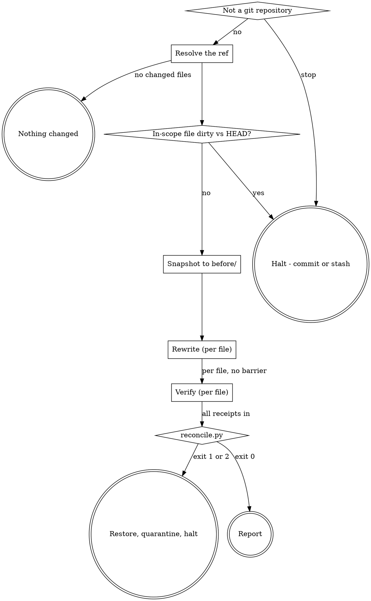

# vernacular Implementation Plan

> **For agentic workers:** REQUIRED SUB-SKILL: Use superpowers:subagent-driven-development (recommended) or superpowers:executing-plans to implement this plan task-by-task. Steps use checkbox (`- [ ]`) syntax for tracking.

**Goal:** Ship `vernacular`, a dashworthy plugin that rewrites a branch's docblock prose in place so it is comprehensible to a human, proving mechanically that it touched nothing else.

**Architecture:** A conductor skill resolves the branch diff into changed files and hunk ranges and never opens a source file. Per file it dispatches a rewriter (applies the comprehension gate, rewrites prose, returns a receipt of replaced line ranges) then an independent verifier (tests each new assertion against the code, reverts what is unsupported). A committed Python script then proves, from receipts alone, that nothing outside the claimed ranges moved and that no claimed range ever contained a structured annotation.

**Tech Stack:** Markdown skills, POSIX `sh`, `python3` (stdlib only — never `jq`), `git`. No runtime dependencies beyond what verity and guardtower already assume.

**Spec:** `docs/superpowers/specs/2026-08-18-vernacular-design.md`

## Global Constraints

- Plugin name is exactly `vernacular`; version is exactly `0.1.0`; license `MIT`.
- Author: `{"name": "Andrew Leach", "email": "7387639+andyleach@users.noreply.github.com"}` — matches guardtower, the most recent plugin.
- All shell is POSIX `sh`. JSON is parsed with `python3` stdlib. **Never require `jq`.**
- Skill directory names are gerunds, matching every existing plugin: `clarifying-docblocks`, `rewriting-docblock-prose`, `verifying-docblock-claims`.
- **The plugin never writes, edits or deletes a structured annotation** — `@param`, `@return`, `@throws`, `@var`, generics, Psalm/PHPStan annotations, Sphinx field lists — including on symbols that have none.
- **No language detection.** No stack table, no per-language docblock syntax file, no skip list. Any task that introduces one contradicts the spec's "Language independence" section.
- ASCII diagrams in docblocks: **72 columns including the ` * ` comment leader**, light box-drawing characters only.
- Run artifacts live at `.vernacular/<YYYY-MM-DD>-<ref>-<suffix>/` in the **user's** repository, never inside the plugin.
- Every task ends with a commit. Commit subjects use the repo's existing convention: `type(vernacular): subject`.

## Deviation from the spec, recorded

The spec's **Plugin layout** section has no home for the two proofs, while its **Reconcile** section requires them to run as shell. This plan adds `vernacular/scripts/reconcile.py` and a `tests/reconcile.sh` that exercises it. Rationale: the proofs are line arithmetic over JSON receipts, and re-deriving that arithmetic inline on every run is precisely how a silent off-by-one enters a tool whose entire value is that it cannot corrupt your source. Task 8 updates the spec's layout block to match.

The script is a **pure checker**. It never restores, quarantines, or mutates anything — the conductor does that with `cp` and `mv`. A checker that also mutates cannot be tested by running it.

---

## File Structure

| File | Responsibility |
|---|---|
| `vernacular/.claude-plugin/plugin.json` | Manifest |
| `vernacular/README.md` | What it is, how a run flows, what it does not guarantee |
| `vernacular/commands/vernacular.md` | `/vernacular [ref]` entry point |
| `vernacular/scripts/reconcile.py` | Both proofs. Pure checker, exit-code + line-per-file output |
| `vernacular/skills/clarifying-docblocks/SKILL.md` | Conductor: scope, dispatch, reconcile, report |
| `vernacular/skills/clarifying-docblocks/references/comprehension-gate.md` | The six failure modes and the untouchable rule |
| `vernacular/skills/clarifying-docblocks/references/diagram-rules.md` | When to draw, when not to, the 72-column budget |
| `vernacular/skills/clarifying-docblocks/references/receipt-schema.md` | Receipt shape and the before-anchor rule |
| `vernacular/skills/rewriting-docblock-prose/SKILL.md` | Per-file rewriter |
| `vernacular/skills/verifying-docblock-claims/SKILL.md` | Per-file independent verifier |
| `vernacular/tests/reconcile.sh` | Unit tests for both proofs |
| `vernacular/tests/validate.sh` | Structural + prose-anchor validation |
| `vernacular/tests/e2e.sh` | Install, discover, refuse-to-run-where-it-cannot |
| `.claude-plugin/marketplace.json` | Marketplace registration (modify) |
| `README.md` | Root plugin table row (modify) |

---

### Task 1: Plugin skeleton, manifest, and marketplace registration

**Files:**
- Create: `vernacular/.claude-plugin/plugin.json`
- Create: `vernacular/tests/validate.sh`
- Modify: `.claude-plugin/marketplace.json`

**Interfaces:**
- Consumes: nothing.
- Produces: the plugin root `vernacular/`, installable as `vernacular@dashworthy`. Later tasks add files beneath it and add checks to `validate.sh`.

- [ ] **Step 1: Write the failing validation script**

Create `vernacular/tests/validate.sh`:

```sh
#!/bin/sh
# Structural and behavioural validation for the vernacular plugin.
# POSIX sh. Uses python3 (stdlib only) for JSON. Never requires jq.
# Run from anywhere: sh vernacular/tests/validate.sh

ROOT=$(cd "$(dirname "$0")/../.." && pwd)
PLUGIN="$ROOT/vernacular"
fail=0

ok()   { printf 'ok   - %s\n' "$1"; }
bad()  { printf 'FAIL - %s\n' "$1"; fail=1; }
check(){ if [ "$1" -eq 0 ]; then ok "$2"; else bad "$2"; fi }

# Match a prose anchor regardless of how the source is line-wrapped. Prose in these documents is
# wrapped for readability; a check that depends on where the wrap falls breaks on a purely
# cosmetic reflow. `--` before the pattern is load-bearing: without it grep parses an anchor
# beginning with a hyphen as its own options and dies with a usage error instead of searching.
grep_flat() {  # grep_flat <file> <literal phrase>
  tr '\n' ' ' < "$1" | tr -s ' ' | grep -qF -- "$2"
}

# --- manifest ---------------------------------------------------------------

[ -f "$PLUGIN/.claude-plugin/plugin.json" ]; check $? "plugin.json exists"

if [ -f "$PLUGIN/.claude-plugin/plugin.json" ]; then
  python3 - "$PLUGIN/.claude-plugin/plugin.json" <<'PY'
import json,sys
d=json.load(open(sys.argv[1]))
required={"name","description","version","author","license"}
missing=required-set(d)
assert not missing, f"plugin.json missing keys: {sorted(missing)}"
assert d["name"]=="vernacular", f'name is {d["name"]!r}, expected "vernacular"'
assert d["version"]=="0.1.0", f'version is {d["version"]!r}, expected "0.1.0"'
assert d["license"]=="MIT", f'license is {d["license"]!r}, expected "MIT"'
PY
  check $? "plugin.json is well-formed"
fi

# --- marketplace registration ------------------------------------------------

python3 - "$ROOT/.claude-plugin/marketplace.json" <<'PY'
import json,sys
d=json.load(open(sys.argv[1]))
names=[p["name"] for p in d["plugins"]]
assert "vernacular" in names, f"vernacular not registered; found {names}"
e=[p for p in d["plugins"] if p["name"]=="vernacular"][0]
assert e["source"]=="./vernacular", f'source is {e["source"]!r}'
assert e["version"]=="0.1.0", f'version is {e["version"]!r}'
PY
check $? "vernacular is registered in the dashworthy marketplace"

exit $fail
```

- [ ] **Step 2: Run it to verify it fails**

Run: `sh vernacular/tests/validate.sh`
Expected: `FAIL - plugin.json exists` and a non-zero exit. The marketplace check raises a `KeyError`/`AssertionError` and reports `FAIL - vernacular is registered in the dashworthy marketplace`.

- [ ] **Step 3: Create the manifest**

Create `vernacular/.claude-plugin/plugin.json`:

```json
{
  "name": "vernacular",
  "description": "Diff-scoped documentation hardening: rewrites a branch's docblock prose into plain language, in place, and proves mechanically that executable code and structured annotations came out byte-identical. Writes no @param, @return or any other tag.",
  "version": "0.1.0",
  "author": { "name": "Andrew Leach", "email": "7387639+andyleach@users.noreply.github.com" },
  "license": "MIT",
  "keywords": ["documentation", "docblocks", "phpdoc", "jsdoc", "docstrings", "readability", "subagents"]
}
```

- [ ] **Step 4: Register in the marketplace**

In `.claude-plugin/marketplace.json`, append to the `plugins` array, after the `guardtower` entry:

```json
    {
      "name": "vernacular",
      "description": "Diff-scoped documentation hardening: rewrites a branch's docblock prose into plain language in place, proving that executable code and structured annotations came out byte-identical.",
      "version": "0.1.0",
      "source": "./vernacular",
      "author": {
        "name": "Andrew Leach",
        "email": "7387639+andyleach@users.noreply.github.com"
      }
    }
```

- [ ] **Step 5: Run validation to verify it passes**

Run: `sh vernacular/tests/validate.sh`
Expected: three `ok -` lines, exit 0.

- [ ] **Step 6: Commit**

```bash
chmod +x vernacular/tests/validate.sh
git add vernacular/.claude-plugin/plugin.json vernacular/tests/validate.sh .claude-plugin/marketplace.json
git commit -m "feat(vernacular): plugin manifest and marketplace registration"
```

---

### Task 2: Proof 1 — nothing outside the claimed ranges moved

**Files:**
- Create: `vernacular/scripts/reconcile.py`
- Create: `vernacular/tests/reconcile.sh`

**Interfaces:**
- Consumes: nothing from earlier tasks.
- Produces: `python3 vernacular/scripts/reconcile.py <run-dir>`, which reads `<run-dir>/receipts/*.json` and `<run-dir>/before/<path>`, and prints one line per receipt. Exit `0` = all proofs pass; `1` = a proof failed; `2` = a receipt or file is malformed or missing. Task 3 extends the same script; Task 7's conductor invokes it as `python3 "${CLAUDE_PLUGIN_ROOT}/scripts/reconcile.py" "$RUN_DIR"`.
- Receipt fields consumed: `file` (absolute working-tree path), `edits[]` with `start`, `end_before`, `lines_after` (all integers), and optional `left_alone`, `reverted`.

- [ ] **Step 1: Write the failing test**

Create `vernacular/tests/reconcile.sh`:

```sh
#!/bin/sh
# Unit tests for vernacular/scripts/reconcile.py.
# Builds each case in a temp run directory from inline heredocs, so the fixtures
# and the assertion about them sit on the same screen.
# Run from anywhere: sh vernacular/tests/reconcile.sh

ROOT=$(cd "$(dirname "$0")/../.." && pwd)
SCRIPT="$ROOT/vernacular/scripts/reconcile.py"
fail=0

ok()  { printf 'ok   - %s\n' "$1"; }
bad() { printf 'FAIL - %s\n' "$1"; fail=1; }

# expect <case-name> <expected-exit> — runs reconcile.py against $RUN and grades the exit code.
expect() {
  out=$(python3 "$SCRIPT" "$RUN" 2>&1); st=$?
  if [ "$st" -eq "$2" ]; then ok "$1"; else bad "$1 (exit $st, expected $2)
$out"; fi
}

# newcase — fresh run directory with before/ and receipts/, and a $WORK tree for after-files.
newcase() {
  RUN=$(mktemp -d); WORK=$(mktemp -d)
  mkdir -p "$RUN/before" "$RUN/receipts"
}

# --- A. clean single edit: 3 lines replaced by 6 ------------------------------

newcase
cat > "$RUN/before/Billing.php" <<'EOF'
<?php
class Billing {
    /**
     * Charges the card.
     */
    public function charge(int $amount): void {
        $this->gateway->charge($amount);
    }
}
EOF
cat > "$WORK/Billing.php" <<'EOF'
<?php
class Billing {
    /**
     * Takes payment for an order that has already been priced.
     * Assumes a card is on file - throws if none is, rather than
     * prompting, because this runs unattended after settlement.
     */
    public function charge(int $amount): void {
        $this->gateway->charge($amount);
    }
}
EOF
cat > "$RUN/receipts/Billing.php.json" <<EOF
{"file": "$WORK/Billing.php",
 "before": "$RUN/before/Billing.php",
 "edits": [{"start": 3, "end_before": 5, "lines_after": 5}],
 "left_alone": 0}
EOF
expect "clean single edit passes proof 1" 0

# --- B. rogue: same receipt, but a line of code also changed ------------------

newcase
cat > "$RUN/before/Billing.php" <<'EOF'
<?php
class Billing {
    /**
     * Charges the card.
     */
    public function charge(int $amount): void {
        $this->gateway->charge($amount);
    }
}
EOF
cat > "$WORK/Billing.php" <<'EOF'
<?php
class Billing {
    /**
     * Takes payment for an order that has already been priced.
     * Assumes a card is on file - throws if none is, rather than
     * prompting, because this runs unattended after settlement.
     */
    public function charge(int $amount): void {
        $this->gateway->charge($amount * 100);
    }
}
EOF
cat > "$RUN/receipts/Billing.php.json" <<EOF
{"file": "$WORK/Billing.php",
 "before": "$RUN/before/Billing.php",
 "edits": [{"start": 3, "end_before": 5, "lines_after": 5}],
 "left_alone": 0}
EOF
expect "code changed outside a claimed range fails proof 1" 1

# --- C. insertion: end_before = start - 1 -------------------------------------

newcase
cat > "$RUN/before/UserSync.php" <<'EOF'
<?php
class UserSync {
    public function reconcile(): void {
    }
}
EOF
cat > "$WORK/UserSync.php" <<'EOF'
<?php
class UserSync {
    /**
     * Brings our copy of a user back in line with the identity
     * provider's. Safe to run repeatedly; it compares before it
     * writes.
     */
    public function reconcile(): void {
    }
}
EOF
cat > "$RUN/receipts/UserSync.php.json" <<EOF
{"file": "$WORK/UserSync.php",
 "before": "$RUN/before/UserSync.php",
 "edits": [{"start": 3, "end_before": 2, "lines_after": 5}],
 "left_alone": 0}
EOF
expect "insertion of a missing docblock passes proof 1" 0

# --- D. two edits: the second one's position depends on the first's drift -----

newcase
cat > "$RUN/before/Two.php" <<'EOF'
<?php
/** One. */
function one() {}
/** Two. */
function two() {}
EOF
cat > "$WORK/Two.php" <<'EOF'
<?php
/**
 * Returns the first configured tenant, or blows up if none is.
 */
function one() {}
/**
 * Returns every tenant after the first, in configuration order.
 */
function two() {}
EOF
cat > "$RUN/receipts/Two.php.json" <<EOF
{"file": "$WORK/Two.php",
 "before": "$RUN/before/Two.php",
 "edits": [{"start": 2, "end_before": 2, "lines_after": 3},
           {"start": 4, "end_before": 4, "lines_after": 3}],
 "left_alone": 0}
EOF
expect "two edits accumulate drift correctly" 0

# --- E. malformed receipt -----------------------------------------------------

newcase
printf '{"file": "/nonexistent", "edits": [' > "$RUN/receipts/broken.json"
expect "malformed receipt exits 2" 2

exit $fail
```

- [ ] **Step 2: Run it to verify it fails**

Run: `sh vernacular/tests/reconcile.sh`
Expected: every case reports `FAIL`, because `vernacular/scripts/reconcile.py` does not exist — `python3` exits `2` with `can't open file`, so cases A, B, C and D fail on exit code and case E passes by coincidence. That coincidence is why case E is not the only malformed-input test.

- [ ] **Step 3: Write the minimal implementation**

Create `vernacular/scripts/reconcile.py`:

```python
#!/usr/bin/env python3
"""vernacular's reconcile checker.

Proves, from receipts alone, that a run touched only what it said it touched.
Reads <run-dir>/receipts/*.json; prints one line per receipt; mutates nothing.

Restoring a corrupted file and quarantining the evidence is the conductor's
job, not this script's. A checker that also mutates cannot be tested by
running it.

Exit codes:
  0  every receipt passed every proof
  1  at least one proof failed
  2  a receipt or a file it names is malformed, missing, or unreadable
"""
import json
import pathlib
import sys

EXIT_OK, EXIT_PROOF_FAILED, EXIT_MALFORMED = 0, 1, 2


def load_lines(path):
    # newline='' keeps line terminators intact, so a proof compares the bytes
    # that are actually in the file rather than a normalisation of them.
    with open(path, newline='') as fh:
        return fh.readlines()


def after_ranges(edits):
    """Derive after-file ranges by walking edits in ascending start order.

    Every anchor in a receipt is a BEFORE-file line number, and lines_after is
    a count rather than a position. That is what lets the verifier delete a
    reverted edit without renumbering the ones below it: drift is recomputed
    here on every run instead of being stored.

    Yields (before_start, before_end, after_start, after_end) with inclusive,
    1-based bounds. An empty range is represented as end < start.
    """
    drift = 0
    for e in sorted(edits, key=lambda x: x["start"]):
        b_start, b_end = e["start"], e["end_before"]
        a_start = b_start + drift
        a_end = a_start + e["lines_after"] - 1
        yield b_start, b_end, a_start, a_end
        drift += e["lines_after"] - (b_end - b_start + 1)


def strip(lines, ranges):
    """Return lines with every 1-based inclusive range removed."""
    drop = set()
    for start, end in ranges:
        drop.update(range(start, end + 1))
    return [ln for i, ln in enumerate(lines, start=1) if i not in drop]


def check_receipt(path):
    """Return (status, message). status is one of ok / fail / malformed."""
    try:
        receipt = json.loads(pathlib.Path(path).read_text())
        edits = receipt["edits"]
        before_lines = load_lines(receipt["before"])
        after_lines = load_lines(receipt["file"])
        for e in edits:
            for key in ("start", "end_before", "lines_after"):
                if not isinstance(e[key], int):
                    raise TypeError(f"{key} is not an integer")
    except Exception as exc:  # noqa: BLE001 - any failure here is malformed input
        return "malformed", f"{type(exc).__name__}: {exc}"

    spans = list(after_ranges(edits))

    # Overlapping claims would make the arithmetic ambiguous, and a receipt
    # that claims the same line twice is a rewriter bug worth surfacing rather
    # than silently tolerating.
    prev_end = 0
    for b_start, b_end, _, _ in spans:
        if b_start <= prev_end:
            return "malformed", f"overlapping claimed ranges at before-line {b_start}"
        prev_end = max(prev_end, b_end)

    before_rest = strip(before_lines, [(b0, b1) for b0, b1, _, _ in spans])
    after_rest = strip(after_lines, [(a0, a1) for _, _, a0, a1 in spans])

    if before_rest != after_rest:
        return "fail", "proof1 remainder differs outside the claimed ranges"
    return "ok", ""


def main(argv):
    if len(argv) != 2:
        print("usage: reconcile.py <run-dir>", file=sys.stderr)
        return EXIT_MALFORMED

    receipts = sorted((pathlib.Path(argv[1]) / "receipts").glob("*.json"))
    if not receipts:
        print("no receipts found", file=sys.stderr)
        return EXIT_MALFORMED

    exit_code = EXIT_OK
    for r in receipts:
        status, message = check_receipt(r)
        if status == "ok":
            print(f"ok   {r.name}")
        elif status == "fail":
            print(f"FAIL {r.name} {message}")
            exit_code = max(exit_code, EXIT_PROOF_FAILED)
        else:
            print(f"MALFORMED {r.name} {message}")
            exit_code = EXIT_MALFORMED
    return exit_code


if __name__ == "__main__":
    sys.exit(main(sys.argv))
```

- [ ] **Step 4: Run tests to verify they pass**

Run: `sh vernacular/tests/reconcile.sh`
Expected: five `ok -` lines, exit 0.

- [ ] **Step 5: Commit**

```bash
chmod +x vernacular/scripts/reconcile.py vernacular/tests/reconcile.sh
git add vernacular/scripts/reconcile.py vernacular/tests/reconcile.sh
git commit -m "feat(vernacular): prove nothing outside a claimed range moved"
```

---

### Task 3: Proof 2 — no claimed range ever contained an annotation

**Files:**
- Modify: `vernacular/scripts/reconcile.py`
- Modify: `vernacular/tests/reconcile.sh`

**Interfaces:**
- Consumes: `check_receipt(path)`, `after_ranges(edits)`, `strip(lines, ranges)` from Task 2.
- Produces: the same exit-code contract, with `proof2` now a possible failure message. No new callers.

- [ ] **Step 1: Write the failing tests**

Append to `vernacular/tests/reconcile.sh`, immediately before the final `exit $fail`:

```sh
# --- F. a claimed range containing @param must be rejected --------------------

newcase
cat > "$RUN/before/Tagged.php" <<'EOF'
<?php
/**
 * Charges the card.
 * @param int $amount
 * @return void
 */
function charge(int $amount): void {}
EOF
cat > "$WORK/Tagged.php" <<'EOF'
<?php
/**
 * Takes payment for an order already priced.
 */
function charge(int $amount): void {}
EOF
cat > "$RUN/receipts/Tagged.php.json" <<EOF
{"file": "$WORK/Tagged.php",
 "before": "$RUN/before/Tagged.php",
 "edits": [{"start": 3, "end_before": 5, "lines_after": 1}],
 "left_alone": 0}
EOF
expect "a claimed range containing @param fails proof 2" 1

# --- G. prose-only range above the tags is legal ------------------------------

newcase
cat > "$RUN/before/Tagged.php" <<'EOF'
<?php
/**
 * Charges the card.
 * @param int $amount
 * @return void
 */
function charge(int $amount): void {}
EOF
cat > "$WORK/Tagged.php" <<'EOF'
<?php
/**
 * Takes payment for an order that has already been priced.
 * Assumes a card is on file.
 * @param int $amount
 * @return void
 */
function charge(int $amount): void {}
EOF
cat > "$RUN/receipts/Tagged.php.json" <<EOF
{"file": "$WORK/Tagged.php",
 "before": "$RUN/before/Tagged.php",
 "edits": [{"start": 3, "end_before": 3, "lines_after": 2}],
 "left_alone": 0}
EOF
expect "a prose-only range above the tags passes both proofs" 0

# --- H. Sphinx field lists count as annotations too ---------------------------

newcase
cat > "$RUN/before/sync.py" <<'EOF'
def reconcile(user_id):
    """Reconciles the user.

    :param user_id: the user
    :returns: nothing
    """
EOF
cat > "$WORK/sync.py" <<'EOF'
def reconcile(user_id):
    """Brings our copy of a user back in line with the provider's."""
EOF
cat > "$RUN/receipts/sync.py.json" <<EOF
{"file": "$WORK/sync.py",
 "before": "$RUN/before/sync.py",
 "edits": [{"start": 2, "end_before": 6, "lines_after": 1}],
 "left_alone": 0}
EOF
expect "a claimed range containing a Sphinx field fails proof 2" 1
```

- [ ] **Step 2: Run tests to verify F and H fail**

Run: `sh vernacular/tests/reconcile.sh`
Expected: `FAIL - a claimed range containing @param fails proof 2 (exit 0, expected 1)` and the same for the Sphinx case. Case G already passes — it is the control, and a Proof 2 implementation that fails G is over-broad in the direction that costs the user real rewrites.

- [ ] **Step 3: Implement Proof 2**

In `vernacular/scripts/reconcile.py`, add `import re` to the imports and insert this above `check_receipt`:

```python
# An annotation line is one whose first non-whitespace content, after an
# optional comment leader, begins with @ or matches a Sphinx field.
#
# This is a pattern, not a language table: it needs no knowledge of the file it
# is applied to, which is what keeps vernacular working on languages nobody has
# registered with it.
#
# It is deliberately over-inclusive. A false positive costs one docblock left
# un-rewritten, which the report names under "Skipped". A false negative costs
# a mangled annotation in the user's source. Widen this freely; never narrow it
# to catch a few more docblocks.
#
# The leader alternation is ordered longest-first: '//' before '#' is
# irrelevant, but '///' must precede '//' or the regex consumes two slashes and
# leaves a third that fails the following @-test.
ANNOTATION = re.compile(
    r'^[ \t]*(?:\*|///|//|--|#)?[ \t]*'
    r'(?:@|:(?:param|type|returns|rtype|raises)\b)'
)


def annotation_in_range(lines, start, end):
    """First 1-based line number in [start, end] that is an annotation, or None."""
    for i in range(start, min(end, len(lines)) + 1):
        if ANNOTATION.match(lines[i - 1]):
            return i
    return None
```

Then, in `check_receipt`, insert this immediately after the overlap check and before `before_rest` is computed:

```python
    # Proof 2 is checked against the BEFORE file, which makes it a precondition
    # on the ranges rather than a comparison of two states: a range containing
    # an annotation was never legal to claim, so there is no window in which a
    # tag is edited and then detected.
    for b_start, b_end, _, _ in spans:
        hit = annotation_in_range(before_lines, b_start, b_end)
        if hit is not None:
            return "fail", (
                f"proof2 annotation at line {hit} inside claimed range "
                f"{b_start}-{b_end}"
            )
```

- [ ] **Step 4: Run tests to verify they pass**

Run: `sh vernacular/tests/reconcile.sh`
Expected: eight `ok -` lines, exit 0.

- [ ] **Step 5: Commit**

```bash
git add vernacular/scripts/reconcile.py vernacular/tests/reconcile.sh
git commit -m "feat(vernacular): reject any claimed range containing an annotation"
```

---

### Task 4: The three reference documents

**Files:**
- Create: `vernacular/skills/clarifying-docblocks/references/comprehension-gate.md`
- Create: `vernacular/skills/clarifying-docblocks/references/diagram-rules.md`
- Create: `vernacular/skills/clarifying-docblocks/references/receipt-schema.md`
- Modify: `vernacular/tests/validate.sh`

**Interfaces:**
- Consumes: the receipt field names from Task 2 — `file`, `before`, `edits[]`, `start`, `end_before`, `lines_after`, `left_alone`, `reverted`.
- Produces: three documents cited by absolute path in the dispatch payloads of Tasks 5, 6 and 7 as `gate_path`, `diagram_path` and `schema_path`.

- [ ] **Step 1: Write the failing validation checks**

Append to `vernacular/tests/validate.sh`, before the final `exit $fail`:

```sh
# --- references --------------------------------------------------------------

REF="$PLUGIN/skills/clarifying-docblocks/references"
for f in comprehension-gate.md diagram-rules.md receipt-schema.md; do
  [ -f "$REF/$f" ]; check $? "references/$f exists"
done

if [ -f "$REF/comprehension-gate.md" ]; then
  grep_flat "$REF/comprehension-gate.md" "Restates the signature";       check $? "gate names the restates-the-signature failure"
  grep_flat "$REF/comprehension-gate.md" "Describes mechanism, not purpose"; check $? "gate names the mechanism failure"
  grep_flat "$REF/comprehension-gate.md" "Machine-facing residue";       check $? "gate names the machine-residue failure"
  grep_flat "$REF/comprehension-gate.md" "When in doubt, leave it";      check $? "gate states the leave-it default"
fi

if [ -f "$REF/diagram-rules.md" ]; then
  grep_flat "$REF/diagram-rules.md" "72 columns including the comment leader"; check $? "diagram rules state the width budget"
fi

if [ -f "$REF/receipt-schema.md" ]; then
  grep_flat "$REF/receipt-schema.md" "lines_after";  check $? "receipt schema documents lines_after"
  grep_flat "$REF/receipt-schema.md" "end_before = start - 1"; check $? "receipt schema documents the insertion form"
fi

# No language table may be reintroduced anywhere in the plugin.
! grep -rlqi 'detecting-the-stack\|stack-marker' "$PLUGIN" 2>/dev/null
check $? "no stack-detection artefact exists in the plugin"
```

- [ ] **Step 2: Run it to verify it fails**

Run: `sh vernacular/tests/validate.sh`
Expected: `FAIL - references/comprehension-gate.md exists` and the two siblings, exit non-zero.

- [ ] **Step 3: Write `comprehension-gate.md`**

```markdown
# The comprehension gate

A description is rewritten **only** if it fails on at least one of the six modes below.
Anything that fails none of them is left exactly as it is.

## The untouchable rule

**Prose that already does its job survives a run unchanged.**

This is an invariant, not a preference. Without it every run rewrites everything, the diff
becomes noise, the user stops reading it, and the tool is worthless whatever the quality of
its prose. The report's `left_alone` count is the only evidence the user has that this rule
still holds.

**When in doubt, leave it.** Rewriting a borderline-adequate description costs the user a
diff hunk they must read and reject. Leaving a borderline-inadequate one costs nothing they
did not already have.

## The six failure modes

| Failure | What it looks like |
|---|---|
| **Restates the signature** | `Sets the user id.` on `setUserId(int $id)` |
| **Describes mechanism, not purpose** | `Loops the items, calls process() on each, flushes the buffer.` |
| **Assumes vocabulary it does not supply** | `Reconciles the tender against the drawer.` |
| **Machine-facing residue** | `Implements task 4 of the sync plan. See brief section 3.` |
| **Empty of consequence** | Never says what it assumes, what happens if you skip it, or what will bite you |
| **Absent** | Tags only, or no docblock at all |

## What passes

This is left alone. It says what the thing is for, when to run it, and what will surprise you:

```php
/**
 * Reconciles what the payment processor thinks we charged against what
 * our own ledger says. Run it after settlement, not before - before
 * settlement the processor's figures are still provisional and every
 * row will look like a mismatch.
 */
```

## What a rewrite says

- What the thing is **for**, in a sentence someone outside the team would follow.
- When you would reach for it, and when you would not.
- What it assumes, and what happens when the assumption does not hold.
- **Never a restatement of the tags.** They are frozen and sitting directly below.
```

- [ ] **Step 4: Write `diagram-rules.md`**

```markdown
# Diagram rules

A diagram is drawn only when the thing has a **shape that prose describes badly**.

## Draw for

- an ordering or pipeline
- a state machine or transition set
- a fan-out or fan-in
- a boundary between inside and outside
- a hierarchy

## Never draw for

- a single linear call
- a restatement of the sentence above it
- box art around a label

## The width budget

**72 columns including the comment leader.** Every line acquires a ` * ` prefix in the file,
docblocks live in a narrow gutter, and IDEs fold them. Light box-drawing characters only.

```
 * request --> validate --> enrich --> persist
 *                |            |
 *                v            v
 *             reject      cache miss --> upstream
```

A diagram that overflows the budget is worse than no diagram: it wraps, and a wrapped
diagram is unreadable in exactly the place a reader most needed it.
```

- [ ] **Step 5: Write `receipt-schema.md`**

```markdown
# Receipt schema

One receipt per file, written by the rewriter to `receipt_path`, amended by the verifier.

```json
{
  "file": "/abs/path/in/the/working/tree/src/Billing.php",
  "before": "/abs/path/to/.vernacular/<run>/before/src/Billing.php",
  "edits": [
    {"start": 108, "end_before": 110, "lines_after": 9},
    {"start": 240, "end_before": 239, "lines_after": 7}
  ],
  "left_alone": 4,
  "reverted": [
    {"start": 302, "claim": "states it retries three times; no retry exists in the method"}
  ]
}
```

## Every anchor is a before-file line number

`start` and `end_before` index the **before** file. `lines_after` is a **count**, not a
position.

This is not cosmetic. If an edit carried its after-file end line, then the verifier reverting
one edit would silently invalidate the recorded position of every edit below it in the file,
and Proof 1 would compare the wrong ranges - failing a clean run, or worse, passing a dirty
one. With before-anchors plus a count, `reconcile.py` derives after-file positions by walking
the edits in ascending `start` and accumulating the drift, so **removing a reverted edit
requires no renumbering at all.**

## Insertions

`end_before = start - 1` is an insertion - a zero-length before-range. Writing a docblock
where none existed needs no special case; the same arithmetic covers it.

## Constraints

- Edits are sorted by `start` and **may not overlap**. `reconcile.py` exits 2 on an overlap.
- `left_alone` counts descriptions the gate examined and deliberately did not touch. It is
  reported on every run and must not be omitted or estimated.
- `reverted` is written by the verifier. Each entry names the claim the code did not support,
  and the corresponding edit is **deleted from `edits`** so the receipt always describes the
  file's final state.
```

- [ ] **Step 6: Run validation to verify it passes**

Run: `sh vernacular/tests/validate.sh`
Expected: all checks `ok`, exit 0.

- [ ] **Step 7: Commit**

```bash
git add vernacular/skills/clarifying-docblocks/references vernacular/tests/validate.sh
git commit -m "docs(vernacular): the comprehension gate, diagram rules, and receipt schema"
```

---

### Task 5: The rewriter skill

**Files:**
- Create: `vernacular/skills/rewriting-docblock-prose/SKILL.md`
- Modify: `vernacular/tests/validate.sh`

**Interfaces:**
- Consumes: `comprehension-gate.md`, `diagram-rules.md`, `receipt-schema.md` from Task 4.
- Produces: a skill named `rewriting-docblock-prose`, dispatched by Task 7's conductor with the payload `{file, hunks, before_path, receipt_path, skill_path, gate_path, diagram_path, schema_path}`. It writes the file in place, writes the receipt, and returns exactly `wrote <N> edits, left <M> alone, receipt at <receipt_path>`.

- [ ] **Step 1: Write the failing validation checks**

Append to `vernacular/tests/validate.sh`, before the final `exit $fail`:

```sh
# --- rewriter ----------------------------------------------------------------

REWRITER="$PLUGIN/skills/rewriting-docblock-prose/SKILL.md"
[ -f "$REWRITER" ]; check $? "rewriting-docblock-prose/SKILL.md exists"

if [ -f "$REWRITER" ]; then
  head -1 "$REWRITER" | grep -q '^---$'; check $? "rewriter has frontmatter"
  grep -q '^name: rewriting-docblock-prose$' "$REWRITER"; check $? "rewriter frontmatter names itself"
  grep_flat "$REWRITER" "never return a description you wrote"; check $? "rewriter states the receipt-only return"
  grep_flat "$REWRITER" "Never claim a range containing an annotation line"; check $? "rewriter states the annotation prohibition"
  grep_flat "$REWRITER" "whole lines"; check $? "rewriter states the whole-line replacement rule"
fi
```

- [ ] **Step 2: Run it to verify it fails**

Run: `sh vernacular/tests/validate.sh`
Expected: `FAIL - rewriting-docblock-prose/SKILL.md exists`, exit non-zero.

- [ ] **Step 3: Write the skill**

Create `vernacular/skills/rewriting-docblock-prose/SKILL.md`:

```markdown
---
name: rewriting-docblock-prose
description: Use when dispatched by vernacular's clarifying-docblocks conductor to rewrite one file's docblock prose - applies the comprehension gate, rewrites only descriptions that fail it, writes the file in place, and returns a receipt of the exact line ranges replaced. Never touches a structured annotation or a line of executable code.
---

# Rewriting Docblock Prose

You are dispatched against **one file**. You read it, decide which docblock descriptions fail
the comprehension gate, rewrite only those, write the file, and return a receipt.

## Your payload

```json
{
  "file":         "<absolute path in the working tree>",
  "hunks":        [{"start": 104, "end": 131}],
  "before_path":  "<absolute path to this file's byte copy>",
  "receipt_path": "<absolute path to write the receipt to>",
  "skill_path":   "<absolute path to this document>",
  "gate_path":    "<absolute path to comprehension-gate.md>",
  "diagram_path": "<absolute path to diagram-rules.md>",
  "schema_path":  "<absolute path to receipt-schema.md>"
}
```

`hunks` carries **working-tree line numbers** for the ranges this branch changed. Read
`gate_path`, `diagram_path` and `schema_path` before you start. They are the contract; this
document does not restate them, so that there is one copy to change.

## Scope

Map each hunk to its **enclosing symbol** - the function, method, or class whose body or
signature the hunk falls inside. Those symbols are your scope.

- A symbol in scope with a docblock: apply the gate to its description.
- A symbol in scope with **no** docblock: write one. Prose only.
- A symbol the hunks do not reach: **out of scope**, even in this same file. Do not touch it,
  however bad its prose is.

## The three prohibitions

1. **Never write, edit, or delete a structured annotation.** `@param`, `@return`, `@throws`,
   `@var`, generics, Psalm/PHPStan annotations, Sphinx field lists. This includes symbols that
   have none: you write prose, never tags.
2. **Never claim a range containing an annotation line.** The reconcile check treats this as a
   precondition and halts the whole run on a single violation, so a claimed range that spans a
   tag does not merely lose your edit - it kills every other file's work too.
3. **Never change a line of executable code**, including whitespace on it.

## Whole lines, always

Every edit replaces **whole lines** with whole lines. Never edit part of a line, and never
leave a rewritten description sharing a line with code. A single-line docblock being expanded
into a block comment is a whole-line replacement of one line by several, which is fine; a
description spliced into the middle of an existing line is not representable in a receipt and
will fail reconciliation.

## Writing the receipt

Per `schema_path`. Every anchor is a **before-file** line number and `lines_after` is a count.
Compute anchors against `before_path`, not against the file as you are editing it - your own
earlier edits have already shifted the working tree's numbering, and a receipt anchored to a
moving target is the one bug reconciliation cannot catch for you.

Sort `edits` by `start`. They may not overlap.

`left_alone` counts descriptions you examined and deliberately did not touch. **Count them
honestly.** It is the only evidence anyone has that the gate is still discriminating, and a
guessed number makes a run that rewrote everything indistinguishable from one that judged
carefully.

## Your return value

Exactly one line:

```
wrote <N> edits, left <M> alone, receipt at <receipt_path>
```

You return a receipt path and two counts. You never return prose, and you **never return a
description you wrote**. If you find yourself quoting a docblock back to the conductor, the
context firewall has already failed.

If the file is unreadable, or you cannot map a hunk to any symbol, write a receipt with an
empty `edits` array and return:

```
wrote 0 edits, left 0 alone, receipt at <receipt_path>  BLOCKED: <one-line reason>
```

## Red flags - STOP

- Editing a line outside a docblock, for any reason, including fixing an obvious typo in the
  code next to it.
- Adding a `@param` to a symbol that had none "for completeness."
- Claiming a range that includes a tag line so you can reflow the whole docblock.
- Rewriting a symbol the hunks do not reach because its prose is bad.
- Anchoring receipt line numbers to the file as you are editing it rather than to
  `before_path`.
- Returning a rewritten description to the conductor.
- Estimating `left_alone` rather than counting it.
```

- [ ] **Step 4: Run validation to verify it passes**

Run: `sh vernacular/tests/validate.sh`
Expected: all checks `ok`, exit 0.

- [ ] **Step 5: Commit**

```bash
git add vernacular/skills/rewriting-docblock-prose vernacular/tests/validate.sh
git commit -m "feat(vernacular): the per-file docblock prose rewriter"
```

---

### Task 6: The claim verifier skill

**Files:**
- Create: `vernacular/skills/verifying-docblock-claims/SKILL.md`
- Modify: `vernacular/tests/validate.sh`

**Interfaces:**
- Consumes: the receipt written by Task 5's rewriter, at `receipt_path`; `receipt-schema.md` from Task 4.
- Produces: a skill named `verifying-docblock-claims`, dispatched with `{file, before_path, receipt_path, skill_path, schema_path}`. It reverts unsupported descriptions in place, amends the receipt, and returns exactly `verified <N> edits, reverted <R>, receipt at <receipt_path>`.

- [ ] **Step 1: Write the failing validation checks**

Append to `vernacular/tests/validate.sh`, before the final `exit $fail`:

```sh
# --- verifier ----------------------------------------------------------------

VERIFIER="$PLUGIN/skills/verifying-docblock-claims/SKILL.md"
[ -f "$VERIFIER" ]; check $? "verifying-docblock-claims/SKILL.md exists"

if [ -f "$VERIFIER" ]; then
  grep -q '^name: verifying-docblock-claims$' "$VERIFIER"; check $? "verifier frontmatter names itself"
  grep_flat "$VERIFIER" "Revert, never repair"; check $? "verifier states revert-never-repair"
  grep_flat "$VERIFIER" "bottom-up"; check $? "verifier states the bottom-up revert order"
  grep_flat "$VERIFIER" "deleted from"; check $? "verifier states that a reverted edit leaves edits[]"
fi
```

- [ ] **Step 2: Run it to verify it fails**

Run: `sh vernacular/tests/validate.sh`
Expected: `FAIL - verifying-docblock-claims/SKILL.md exists`, exit non-zero.

- [ ] **Step 3: Write the skill**

Create `vernacular/skills/verifying-docblock-claims/SKILL.md`:

```markdown
---
name: verifying-docblock-claims
description: Use when dispatched by vernacular's clarifying-docblocks conductor to check one file's freshly rewritten docblock prose against the code it describes - reverts any description asserting behaviour the code does not support, and amends the receipt. Reverts, never repairs.
---

# Verifying Docblock Claims

You are dispatched against **one file** that a rewriter has just changed. Your job is to catch
prose that is confidently wrong.

**You did not write this prose, and that is the point.** A rewriter grading its own
descriptions agrees with itself. Read what is there as a skeptic reading someone else's work.

## Your payload

```json
{
  "file":         "<absolute path in the working tree>",
  "before_path":  "<absolute path to this file's byte copy>",
  "receipt_path": "<absolute path to the receipt the rewriter wrote>",
  "skill_path":   "<absolute path to this document>",
  "schema_path":  "<absolute path to receipt-schema.md>"
}
```

## What you are testing

For each edit in the receipt, read the new description and the code it documents. Every
assertion it makes must be supported by that code. These fail:

- **Behaviour that is not there.** "Retries three times" in a method with no retry.
- **A precondition the code neither enforces nor relies on.** "Must be called after
  `connect()`" when nothing breaks if it is not.
- **A collaborator that does not exist.** A named class, method, or service the code never
  reaches.
- **An error path that is not raised.** "Throws if the card is missing" when it returns null.
- **A diagram whose arrows do not match the call order.** A diagram is a set of assertions
  drawn instead of written, and it is verified exactly as strictly.

Prose that is vague, or that emphasises the wrong thing, is **not** a failure. You are testing
truth, not quality. Reverting merely-mediocre prose to worse prose helps nobody.

## Revert, never repair

An unsupported claim means the docblock goes back to its **original bytes** from
`before_path`. You do not rewrite it, improve it, or hedge it.

Repairing is a second guess at the thing that was just got wrong, by an agent with no more
information than the one that got it wrong. The original prose was at least honest about being
unhelpful; a repaired claim is a fresh assertion nobody checked.

## Amending the receipt

Per `schema_path`:

1. Revert **bottom-up** - highest `start` first. Reverting top-down shifts the working-tree
   position of every edit below the one you just undid, and you will then revert the wrong
   lines.
2. The reverted edit is **deleted from `edits`**, so the receipt always describes the file's
   final state.
3. Append to `reverted`: `{"start": <before-anchor>, "claim": "<the assertion, and what the
   code actually does>"}`.
4. Leave every other edit's `start`, `end_before` and `lines_after` untouched. They are
   before-file anchors and a count; they do not move when a sibling is removed. If you find
   yourself renumbering, re-read the schema - you have misread a count as a position.

## Your return value

Exactly one line:

```
verified <N> edits, reverted <R>, receipt at <receipt_path>
```

Never the prose you read, and never the prose you reverted. The claim text goes in the
receipt, where the conductor reads it as a field.

## Red flags - STOP

- Rewriting an unsupported description instead of reverting it.
- Reverting prose for being vague, clumsy, or not to your taste.
- Reverting top-down.
- Renumbering surviving edits after removing one.
- Editing a line outside the ranges the receipt claims.
- Returning a description to the conductor instead of a count.
- Passing a description you could not verify because the code was hard to follow. If you
  cannot support it, it is not supported.
```

- [ ] **Step 4: Run validation to verify it passes**

Run: `sh vernacular/tests/validate.sh`
Expected: all checks `ok`, exit 0.

- [ ] **Step 5: Commit**

```bash
git add vernacular/skills/verifying-docblock-claims vernacular/tests/validate.sh
git commit -m "feat(vernacular): the independent docblock claim verifier"
```

---

### Task 7: The conductor skill

**Files:**
- Create: `vernacular/skills/clarifying-docblocks/SKILL.md`
- Modify: `vernacular/tests/validate.sh`

**Interfaces:**
- Consumes: `rewriting-docblock-prose` (Task 5), `verifying-docblock-claims` (Task 6), `scripts/reconcile.py` (Tasks 2-3), all three references (Task 4).
- Produces: a skill named `clarifying-docblocks`, invoked by Task 8's `/vernacular` command with a ref or nothing.

- [ ] **Step 1: Write the failing validation checks**

Append to `vernacular/tests/validate.sh`, before the final `exit $fail`:

```sh
# --- conductor ---------------------------------------------------------------

COND="$PLUGIN/skills/clarifying-docblocks/SKILL.md"
[ -f "$COND" ]; check $? "clarifying-docblocks/SKILL.md exists"

if [ -f "$COND" ]; then
  grep -q '^name: clarifying-docblocks$' "$COND"; check $? "conductor frontmatter names itself"
  grep_flat "$COND" "file modified relative to"; check $? "conductor states the dirty-file halt"
  grep_flat "$COND" "never opens a source file"; check $? "conductor states the context firewall"
  grep_flat "$COND" "restore it from"; check $? "conductor states the quarantine-and-restore path"
  grep_flat "$COND" "Left alone"; check $? "conductor reports the left-alone count"
  grep_flat "$COND" "/dev/urandom"; check $? "conductor derives the run suffix from system entropy"
  # Every dispatch payload must name skill_path - the defect guardtower found live.
  grep -c 'skill_path' "$COND" | awk '$1 >= 2 {exit 0} {exit 1}'
  check $? "conductor names skill_path in both dispatch payloads"
fi
```

- [ ] **Step 2: Run it to verify it fails**

Run: `sh vernacular/tests/validate.sh`
Expected: `FAIL - clarifying-docblocks/SKILL.md exists`, exit non-zero.

- [ ] **Step 3: Write the skill**

Create `vernacular/skills/clarifying-docblocks/SKILL.md`:

```markdown
---
name: clarifying-docblocks
description: Use when rewriting a branch's docblock prose into plain language with vernacular - dispatches a rewriter and an independent claim verifier per changed file, proves mechanically that only comment prose moved, and halts if executable code or a structured annotation changed. Never writes @param, @return or any other tag.
---

# Clarifying Docblocks

## The two rules

> **Rule one - prose only.** vernacular rewrites human-readable descriptions. It never writes,
> edits or deletes a structured annotation, and never changes a line of executable code.

> **Rule two - the context firewall.** The conductor **never opens a source file.** It routes
> paths and line ranges, dispatches, and reads receipts.

Rule one is proved by `scripts/reconcile.py`, not asserted. Rule two requires that every read
happen in a dispatched subagent. When an instruction below appears to conflict with either
rule, the rule wins and the run halts.

## Pipeline



Rewrite and verify are **pipelined per file** - file B does not wait on file A. The only
barrier is reconcile, which needs every receipt.

## Preflight

1. **Not a git repository** - stop.
2. **Resolve the ref.** No argument means the current branch against its merge-base with the
   default branch:

   ```sh
   BASE=$(git merge-base HEAD "$(git symbolic-ref --short refs/remotes/origin/HEAD | sed 's|^origin/||')")
   git diff --name-only "$BASE"...HEAD
   ```

   Hunk ranges come from `git diff --unified=0 "$BASE"...HEAD -- <path>`, parsed for the
   **after-side** line numbers. Parsing `@@` headers is not reading the file, and the diff body
   must not enter this context - request `--unified=0` so there is none to read.
3. **Any in-scope file modified relative to `HEAD`** - `git status --porcelain -- <paths>` -
   **halt**, name the files, say commit or stash.

   The comparison is against `HEAD`, not the merge-base: every in-scope file differs from the
   merge-base by definition, since that is what put it in scope. What is at risk is work the
   branch has not committed yet.

   This is load-bearing. The whole delivery model is "the rewrites land in your working tree,
   `git diff` is the review, `git checkout` is the undo." That undo is only safe if there is
   nothing else in the file to lose.
4. **No changed files** - say so plainly and stop.
5. **Snapshot** every in-scope file to `before/<path>` with `cp`. A copy is a shell operation,
   not a read: the bytes never enter this context, and they are Proof 1's left-hand side.

## Run directory

`.vernacular/<YYYY-MM-DD>-<ref>-<suffix>/` at the repository root, where `suffix` is six
lowercase alphanumerics from the system entropy source, never from the model:

```sh
LC_ALL=C tr -dc 'a-z0-9' < /dev/urandom | head -c 6
```

```
before/<path>          byte copies - Proof 1's left-hand side
receipts/<slug>.json   claimed ranges, per file
quarantine/<path>      only on a proof failure
report.md              the run's account of itself
```

`<slug>` is the repository-relative path with `/` replaced by `-`, so two files sharing a
basename in different directories cannot collide.

A random suffix means a run never enumerates prior runs to pick a name, so "a run never reads a
previous run's artifacts" holds with no carve-out. If the directory somehow exists, regenerate
rather than reuse - that is a `stat`, not a read.

## Dispatch

Per file, dispatch `rewriting-docblock-prose`:

```json
{
  "file":         "<absolute path in the working tree>",
  "hunks":        [{"start": 104, "end": 131}],
  "before_path":  "<absolute path to .vernacular/<run>/before/<path>>",
  "receipt_path": "<absolute path to .vernacular/<run>/receipts/<slug>.json>",
  "skill_path":   "<absolute path to that skill's SKILL.md>",
  "gate_path":    "<absolute path to references/comprehension-gate.md>",
  "diagram_path": "<absolute path to references/diagram-rules.md>",
  "schema_path":  "<absolute path to references/receipt-schema.md>"
}
```

Then, for that same file, dispatch `verifying-docblock-claims`:

```json
{
  "file":         "<the same absolute path>",
  "before_path":  "<the same before copy>",
  "receipt_path": "<the receipt the rewriter wrote>",
  "skill_path":   "<absolute path to that skill's SKILL.md>",
  "schema_path":  "<absolute path to references/receipt-schema.md>"
}
```

**Name every path.** A subagent cannot resolve a relative citation from a directory it was
never told it is standing in - the defect guardtower found on its first live run, where an
analyst was told to write "the shape `finding-schema.md` defines" and never told where that
document was. `skill_path` appears in both payloads for the same reason.

Both return one line: counts and a receipt path. **A returned description means the firewall
has already failed** - halt and say so rather than using it.

## Reconcile

Once every receipt is in:

```sh
python3 "${CLAUDE_PLUGIN_ROOT}/scripts/reconcile.py" "$RUN_DIR"
```

- **Exit 0** - both proofs held for every file. Go to **Report**.
- **Exit 1** - a proof failed. For each `FAIL` line, **restore it from `before/`**, move the
  working-tree version to `quarantine/<path>`, and halt.
- **Exit 2** - a receipt is malformed or a file it names is missing. Same restore-and-quarantine
  for every file named, and halt.

Restore every file the run touched, not only the failing one. A run whose arithmetic is wrong
about one file has not earned trust about the others.

**guardtower's never-auto-revert rule does not transfer here, and the difference is worth
knowing so nobody re-imports it.** There, a violation is an unexpected write into a tree the
tool promised never to touch, and reverting would destroy evidence of a bug worth diagnosing.
Here the tool writes to source by design, and a proof failure means it has demonstrably
corrupted a file. Leaving it corrupted is the worse outcome; quarantining preserves everything
a diagnosis needs.

Read `reconcile.py`'s output lines. **Do not open a quarantined file to see what went wrong.**
The failure is the finding.

## Report

Write `report.md` and tell the user, every run, four things:

- **Rewritten**, per file.
- **Left alone**, with a count, summed from the receipts' `left_alone`.
- **Reverted by the verifier**, each with the claim from the receipt's `reverted` array.
- **Skipped**, with the reason.

The left-alone count is not decoration. It is the only evidence the user has that the gate is
still discriminating rather than rubber-stamping, and a report omitting it makes a run that
rewrote everything indistinguishable from one that judged carefully.

State both proofs explicitly, pass or fail. An unavailable check that goes unmentioned reads
exactly like a check that passed.

Then say plainly: the rewrites are unstaged in the working tree, `git diff` is the review, and
`git checkout -- .` is the undo.

Invoke `superpowers:verification-before-completion` before reporting anything as done.

## Error handling

| Situation | Behaviour |
|---|---|
| Not a git repository | Stop. |
| No changed files | Say so, stop. No run directory. |
| An in-scope file is dirty vs `HEAD` | Halt before any dispatch. Name the files. |
| A rewriter returns `BLOCKED` | Skip that file, name it under **Skipped**, continue with the others. One unreadable file does not cost the run. |
| A verifier returns `BLOCKED` | Restore that file from `before/` and name it under **Skipped**. Unverified prose is never kept. |
| `reconcile.py` exits 1 or 2 | Restore every touched file, quarantine, halt. |
| A subagent returns a description instead of a count | Halt. The firewall has failed and the run's context is no longer trustworthy. |
| No subagent capability | vernacular requires dispatch. Run each file's rewrite and verification inline in this thread and **say so** - context purity is degraded, and the verifier is no longer independent, which is the more serious of the two. Never skip the verification stage to compensate. |

## Red flags - STOP

- Opening a source file, a `before/` copy, or a quarantined file in this context.
- Reading a receipt's prose fields for anything but the `reverted` claim text.
- Dispatching a rewriter without `before_path`, so it anchors receipt line numbers to a file it
  is actively editing.
- Running the rewriter and the verifier as the same dispatch, or skipping verification because
  the prose "looks fine."
- Continuing past a `reconcile.py` non-zero exit.
- Reporting without the left-alone count.
- Writing a config file to save yourself asking next time.
- Reintroducing language detection - a stack table, a docblock-syntax file, a skip list. It was
  considered and deliberately not built; the proofs are language-independent and must stay so.
- Widening scope to every docblock in a touched file.
```

- [ ] **Step 4: Run validation to verify it passes**

Run: `sh vernacular/tests/validate.sh`
Expected: all checks `ok`, exit 0.

- [ ] **Step 5: Commit**

```bash
git add vernacular/skills/clarifying-docblocks/SKILL.md vernacular/tests/validate.sh
git commit -m "feat(vernacular): the conductor, with both proofs enforced before release"
```

---

### Task 8: Command, READMEs, and the spec's layout correction

**Files:**
- Create: `vernacular/commands/vernacular.md`
- Create: `vernacular/README.md`
- Modify: `README.md`
- Modify: `docs/superpowers/specs/2026-08-18-vernacular-design.md`
- Modify: `vernacular/tests/validate.sh`

**Interfaces:**
- Consumes: `clarifying-docblocks` (Task 7).
- Produces: `/vernacular [ref]`, discoverable after install — the surface Task 9's e2e exercises.

- [ ] **Step 1: Write the failing validation checks**

Append to `vernacular/tests/validate.sh`, before the final `exit $fail`:

```sh
# --- command and READMEs ------------------------------------------------------

CMD="$PLUGIN/commands/vernacular.md"
[ -f "$CMD" ]; check $? "commands/vernacular.md exists"
if [ -f "$CMD" ]; then
  grep -q '^description:' "$CMD"; check $? "command has a description"
  grep_flat "$CMD" "clarifying-docblocks"; check $? "command invokes the conductor by name"
fi

[ -f "$PLUGIN/README.md" ]; check $? "vernacular/README.md exists"
if [ -f "$PLUGIN/README.md" ]; then
  grep_flat "$PLUGIN/README.md" "does not guarantee"; check $? "README states what it does not guarantee"
fi

grep_flat "$ROOT/README.md" "vernacular"; check $? "root README lists vernacular"
```

- [ ] **Step 2: Run it to verify it fails**

Run: `sh vernacular/tests/validate.sh`
Expected: `FAIL - commands/vernacular.md exists`, exit non-zero.

- [ ] **Step 3: Write the command**

Create `vernacular/commands/vernacular.md`:

```markdown
---
description: Rewrite this branch's docblock prose into plain language, in place, proving that executable code and structured annotations came out byte-identical
---

Clarify the docblocks changed by `$ARGUMENTS`.

`$ARGUMENTS` is optional. Empty means the current branch against its merge-base with the
default branch. Otherwise it is a branch name, or a PR/MR reference.

Invoke the `clarifying-docblocks` skill with that ref and follow it exactly.

Do not rewrite a docblock on a symbol the diff does not reach. Do not write, edit or delete
`@param`, `@return`, or any other structured annotation - including on a symbol that has none.
Do not proceed past a failing reconcile check.
```

- [ ] **Step 4: Write the plugin README**

Create `vernacular/README.md`:

```markdown
# vernacular

**Diff-scoped documentation hardening.** It rewrites the docblock prose your branch touched so
a human reading the code can tell what it is for - and proves it changed nothing else.

## Two properties it serves

**Prose only.** vernacular writes human-readable descriptions. It never writes, edits or
deletes a structured annotation - `@param`, `@return`, `@throws`, `@var`, generics,
Psalm/PHPStan annotations, Sphinx field lists - including on symbols that have none. Static
analysis cannot break, because the tool cannot reach the lines static analysis reads.

**Provably nothing else moved.** Every rewriter reports the exact line ranges it replaced.
Delete those ranges from the before-file and the after-file, and the remainders must be
byte-identical. Separately, a range containing an annotation was never legal to claim. Either
proof failing halts the run, restores your files, and quarantines the evidence.

## It identifies no language

There is no stack detection, no per-language docblock syntax table, and no skip list.
Recognising a docblock is something a model reading a file does the way you do, and the proof
that nothing else moved is line arithmetic, which is identical in every language. It works on
PHP, Go, Ruby, Terraform, or a language written after this README.

## How a run flows

```
preflight --> snapshot --> rewrite (per file) --> verify (per file) --> reconcile --> report
                              |____ pipelined, no barrier ____|          barrier
```

The conductor never opens a source file. Per changed file it dispatches a rewriter, which
applies the comprehension gate and returns a receipt of line ranges; then an **independent**
verifier, which tests every new assertion against the code and reverts what the code does not
support. A rewriter grading its own prose agrees with itself, which is why those are two
agents.

## Installation

```
/plugin marketplace add https://github.com/dashworthy/development-skills
/plugin install vernacular@dashworthy
```

## How to run it

```
/vernacular            the current branch against its merge-base
/vernacular <branch>   a named branch
/vernacular 482        a PR or MR
```

Rewrites land unstaged in your working tree. `git diff` is the review; `git checkout -- .` is
the undo.

## Before it will start

It halts if any file in scope has uncommitted changes relative to `HEAD`. The undo it promises
you is only safe when there is nothing else in the file to lose.

## What vernacular does not guarantee

- **That the new prose is right.** The verifier tests assertions against the code and reverts
  what it cannot support. It cannot detect prose that is true, comprehensible, and misses the
  point.
- **That your documentation is now complete.** Scope is the diff. Symbols your branch did not
  touch keep whatever prose they had.
- **Type coverage.** It writes no annotations, including on symbols that have none. That is a
  static analysis concern, and this tool is deliberately incapable of touching it.
- **That a diagram is the best diagram.** It draws when there is a shape and stays quiet
  otherwise; it does not iterate toward the clearest possible rendering.
```

- [ ] **Step 5: Add the root README row**

In `README.md`, add to the plugin table after the `verity` row:

```markdown
| **[vernacular](vernacular/README.md)** `0.1.0` | Diff-scoped documentation hardening. Rewrites the docblock prose your branch touched into plain language, in place, drawing an ASCII diagram where the thing has a shape. Proves that executable code and structured annotations came out byte-identical, and halts if they did not. Writes no `@param`, `@return`, or any other tag. | `/vernacular [ref]` |
```

- [ ] **Step 6: Correct the spec's layout block**

Two corrections to `docs/superpowers/specs/2026-08-18-vernacular-design.md`.

First, in the **Receipt schema** section, add a `"before"` field and make `"file"` absolute:

```json
{
  "file": "/abs/path/in/the/working/tree/src/Billing.php",
  "before": "/abs/path/to/.vernacular/<run>/before/src/Billing.php",
  "edits": [ ... ]
}
```

`reconcile.py` resolves both sides of Proof 1 from the receipt alone. Deriving the before-path
from the run directory instead would tie the checker to one directory layout and make it
untestable outside a real run - which is exactly what `tests/reconcile.sh` must do.

Second, under **Plugin layout**, add `scripts/reconcile.py` and `tests/reconcile.sh` to the
tree, and append this paragraph beneath it:

```markdown
`scripts/reconcile.py` is where the two proofs live. The spec originally described them as
"shell" without giving them a home; re-deriving line arithmetic inline on every run is how a
silent off-by-one enters a tool whose entire value is that it cannot corrupt your source. It is
a **pure checker** - restoring and quarantining are the conductor's job, because a checker that
also mutates cannot be tested by running it.
```

- [ ] **Step 7: Run validation to verify it passes**

Run: `sh vernacular/tests/validate.sh`
Expected: all checks `ok`, exit 0.

- [ ] **Step 8: Commit**

```bash
git add vernacular/commands vernacular/README.md README.md vernacular/tests/validate.sh docs/superpowers/specs/2026-08-18-vernacular-design.md
git commit -m "feat(vernacular): the /vernacular command and plugin documentation"
```

---

### Task 9: End-to-end install and refusal

**Files:**
- Create: `vernacular/tests/e2e.sh`

**Interfaces:**
- Consumes: everything. This is the last task.
- Produces: nothing further depends on it.

- [ ] **Step 1: Write the end-to-end test**

Create `vernacular/tests/e2e.sh`. It follows guardtower's e2e conventions exactly — three-state
grading, an ownership snapshot before touching the user-scoped plugin registry, and a bounded
`claude -p`. Rather than duplicating those helpers by hand, copy them:

```sh
sh -c 'sed -n "/^run_limited()/,/^}/p;/^classify_claude_failure()/,/^}/p;/^run_with_quorum()/,/^}/p;/^detect_state()/,/^}/p" guardtower/tests/e2e.sh'
```

If the `guardtower` branch is not merged, read them with
`git show guardtower:guardtower/tests/e2e.sh`.

The vernacular-specific body, after those helpers and the same ownership snapshot:

```sh
mkdir -p "$TMP/proj" && cd "$TMP/proj" && git init -q
git config user.email t@example.com && git config user.name t
mkdir -p src
cat > src/Billing.php <<'EOF'
<?php
class Billing {
    /**
     * Charges the card.
     * @param int $amount
     */
    public function charge(int $amount): void {}
}
EOF
git add src/Billing.php && git commit -qm init

# 1. The command must be discoverable.
run_with_quorum 'vernacular' \
  claude -p "List the slash commands available from the vernacular plugin. Names only." \
  --model claude-haiku-4-5-20251001
case "$qr_result" in
  ok)   printf 'ok   - command is discoverable after install\n' ;;
  fail) printf 'FAIL - command is discoverable after install\n%s\n' "$qr_text"; fail=1 ;;
  *)    printf 'INCONCLUSIVE - command is discoverable after install\n%s\n' "$qr_text"; inconclusive=1 ;;
esac

# 2. With a dirty in-scope file, preflight must halt before any dispatch.
echo '// scratch' >> src/Billing.php
run_with_quorum 'uncommitted|dirty|commit or stash|modified relative to HEAD' \
  claude -p "/vernacular:vernacular" --model claude-haiku-4-5-20251001
case "$qr_result" in
  ok)   printf 'ok   - halts on a dirty in-scope file\n' ;;
  fail) printf 'FAIL - halts on a dirty in-scope file\n%s\n' "$qr_text"; fail=1 ;;
  *)    printf 'INCONCLUSIVE - halts on a dirty in-scope file\n%s\n' "$qr_text"; inconclusive=1 ;;
esac

# 3. A halted run must leave no artifacts.
[ ! -d "$TMP/proj/.vernacular" ] \
  && printf 'ok   - no artifacts written on a halted run\n' \
  || { printf 'FAIL - no artifacts written on a halted run\n'; fail=1; }

# 4. And must not have touched the source it refused to process.
grep -q 'Charges the card.' "$TMP/proj/src/Billing.php" \
  && printf 'ok   - source untouched on a halted run\n' \
  || { printf 'FAIL - source untouched on a halted run\n'; fail=1; }

# 5. The annotation must survive any run, and this one never started.
grep -q '@param int \$amount' "$TMP/proj/src/Billing.php" \
  && printf 'ok   - the @param annotation is intact\n' \
  || { printf 'FAIL - the @param annotation is intact\n'; fail=1; }
```

Close with guardtower's exit-code convention: real failure wins over inconclusive; `1` for a
behavioural failure, `2` for inconclusive, `0` for clean.

- [ ] **Step 2: Run the unit suites to confirm they still pass**

Run: `sh vernacular/tests/validate.sh && sh vernacular/tests/reconcile.sh`
Expected: both all-`ok`, exit 0.

- [ ] **Step 3: Run the end-to-end test**

Run: `sh vernacular/tests/e2e.sh`
Expected: exit 0 with five `ok -` lines. Exit 2 (`INCONCLUSIVE`) if the dashworthy marketplace
or `vernacular@dashworthy` is already registered on this machine — that is correct behaviour,
not a failure: the script never touches a registration it did not itself create.

- [ ] **Step 4: Commit**

```bash
chmod +x vernacular/tests/e2e.sh
git add vernacular/tests/e2e.sh
git commit -m "test(vernacular): end-to-end install, discovery, and preflight refusal"
```

---

## Spec coverage

| Spec section | Task |
|---|---|
| The problem | 8 (READMEs) |
| Scope — changed symbols, missing docblocks written, no widening to whole files | 5, 7 |
| Invariant 1, prose only | 3, 5, 6, 7 |
| Invariant 2, executable code byte-identical | 2, 7 |
| Invariant 3, good prose untouchable | 4 (gate), 5, 7 (report) |
| Language independence | 4 (validate.sh guard), 7, 8 |
| The comprehension gate, six failure modes | 4 |
| What a rewrite says | 4 |
| Diagram rules, 72 columns | 4 |
| Architecture, three skills, pipelined | 5, 6, 7 |
| Rewriter and verifier dispatch payloads | 7 |
| Receipt schema, before-anchors, insertions | 2, 4 |
| Reconcile, both proofs | 2, 3 |
| Reconcile failure — restore, quarantine, halt | 7 |
| Preflight, dirty-file halt | 7, 9 |
| Run directory, entropy suffix, slugging | 7 |
| The report, four things, left-alone count | 7 |
| Invocation, no hook | 8 |
| Plugin layout | 1, 8 |
| Testing table | 2, 3, 9 |
| What vernacular does not guarantee | 8 |
