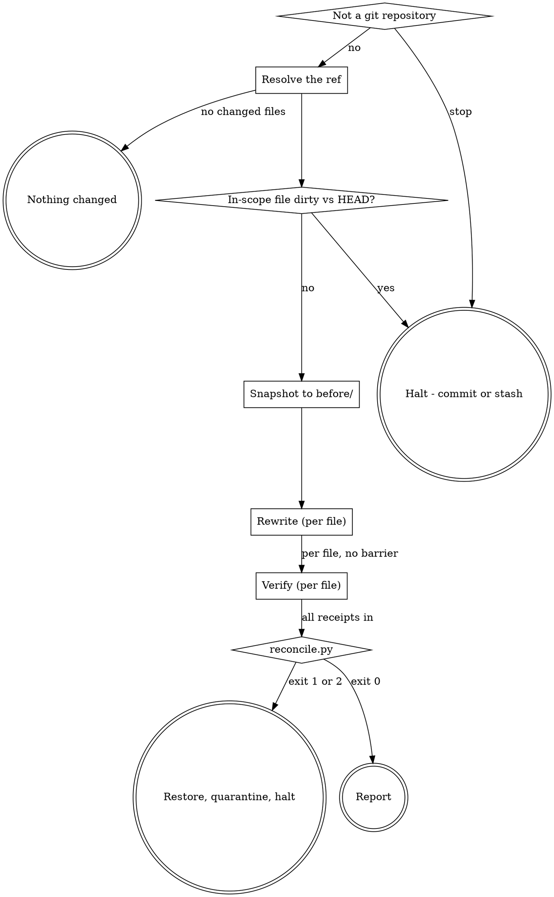

# Clarifying Docblocks

## The two rules

> **Rule one - prose only.** vernacular rewrites human-readable descriptions. It never writes,
> edits or deletes a structured annotation, and never changes a line of executable code.

> **Rule two - the context firewall.** The conductor **never opens a source file.** It routes
> paths and line ranges, dispatches, and reads receipts.

Rule one is proved by `scripts/reconcile.py`, not asserted. Rule two requires that every read
happen in a dispatched subagent. When an instruction below appears to conflict with either
rule, the rule wins and the run halts. The **one** exception is the no-subagent degradation
named in `## Error handling`, which is announced to the user rather than taken silently.

## Pipeline



Rewrite and verify are **pipelined per file** - file B does not wait on file A. The only
barrier is reconcile, which needs every receipt.

## Preflight

1. **Not a git repository** - stop.
2. **Resolve the ref.** No argument means the current branch against its merge-base with the
   default branch:

   ```sh
   BASE=$(git merge-base HEAD "$(git symbolic-ref --short refs/remotes/origin/HEAD | sed 's|^origin/||')")
   git diff --name-only "$BASE"...HEAD
   ```

   Hunk ranges come from the **after-side** line numbers of the diff, and the diff body must never
   enter this context. `--unified=0` does not achieve that on its own: it removes the unchanged
   context lines but still prints every changed line, and the `@@` header's own trailing suffix
   carries the enclosing function's source text. Filter the ranges out before the result can reach
   you:

   ```sh
   git diff --unified=0 "$BASE"...HEAD -- <path> \
     | sed -n 's/^@@ [^@]* +\([0-9]*\(,[0-9]*\)*\) @@.*/\1/p'
   ```

   That prints `104,28` style tokens — a start line and a length — and nothing else. **Never run a
   bare `git diff` at any context level**: its output is the user's source, and reading it here is
   exactly what Rule two forbids.
3. **Any in-scope file modified relative to `HEAD`** - `git status --porcelain -- <paths>` -
   **halt**, name the files, say commit or stash.

   The comparison is against `HEAD`, not the merge-base: every in-scope file differs from the
   merge-base by definition, since that is what put it in scope. What is at risk is work the
   branch has not committed yet.

   This is load-bearing. The whole delivery model is "the rewrites land in your working tree,
   `git diff` is the review, `git checkout` is the undo." That undo is only safe if there is
   nothing else in the file to lose.
4. **No changed files** - say so plainly and stop.
5. **Snapshot** every in-scope file to `before/<path>` with `cp`. A copy is a shell operation,
   not a read: the bytes never enter this context, and they are Proof 1's left-hand side.

## Run directory

`.engineering/<run>/vernacular/` in the **user's** project - never inside the plugin. `<run>`
is not yours to name: obtain it by running
`sh "${CLAUDE_PLUGIN_ROOT}/scripts/run-context.sh" vernacular`, which prints the absolute path
of `.engineering/<run>/vernacular/` and creates it if needed. If vernacular runs standalone -
no earlier phase has run in this session - this same call creates the
`.engineering/.current-run` pointer itself; if a run is already active, it joins that run
instead.

```
before/<path>          byte copies - Proof 1's left-hand side
receipts/<slug>.json   claimed ranges, per file
quarantine/<path>      only on a proof failure
report.md              the run's account of itself
```

`<slug>` is the repository-relative path with `/` replaced by `-`, so two files sharing a
basename in different directories cannot collide.

`run-context.sh` never enumerates prior runs to pick a name - it reads or writes a single
pointer file - so "a run never reads a previous run's artifacts" still holds with no
carve-out.

## Dispatch

Per file, dispatch `rewriting-docblock-prose`:

```json
{
  "file":         "<absolute path in the working tree>",
  "hunks":        [{"start": 104, "end": 131}],
  "before_path":  "<absolute path to .engineering/<run>/vernacular/before/<path>>",
  "receipt_path": "<absolute path to .engineering/<run>/vernacular/receipts/<slug>.json>",
  "skill_path":   "<absolute path to that skill's SKILL.md>",
  "gate_path":    "<absolute path to references/comprehension-gate.md>",
  "diagram_path": "<absolute path to references/diagram-rules.md>",
  "schema_path":  "<absolute path to references/receipt-schema.md>"
}
```

Then, for that same file, dispatch `verifying-docblock-claims`:

```json
{
  "file":         "<the same absolute path>",
  "before_path":  "<the same before copy>",
  "receipt_path": "<the receipt the rewriter wrote>",
  "skill_path":   "<absolute path to that skill's SKILL.md>",
  "schema_path":  "<absolute path to references/receipt-schema.md>"
}
```

**Name every path.** A subagent cannot resolve a relative citation from a directory it was
never told it is standing in - the defect guardtower found on its first live run, where an
analyst was told to write "the shape `finding-schema.md` defines" and never told where that
document was. `skill_path` appears in both payloads for the same reason.

Both return one line: counts and a receipt path. **A returned description means the firewall
has already failed** - halt and say so rather than using it.

## Reconcile

Once every receipt is in:

```sh
python3 "${CLAUDE_PLUGIN_ROOT}/scripts/reconcile.py" "$RUN_DIR"
```

- **Exit 0** - both proofs held for every file. Go to **Report**.
- **Exit 1** - a proof failed. For each `FAIL` line, **restore it from `before/`**, move the
  working-tree version to `quarantine/<path>`, and halt.
- **Exit 2** - a receipt is malformed or a file it names is missing. Same restore-and-quarantine
  for every file named, and halt.

Restore every file the run touched, not only the failing one. A run whose arithmetic is wrong
about one file has not earned trust about the others.

**guardtower's never-auto-revert rule does not transfer here, and the difference is worth
knowing so nobody re-imports it.** There, a violation is an unexpected write into a tree the
tool promised never to touch, and reverting would destroy evidence of a bug worth diagnosing.
Here the tool writes to source by design, and a proof failure means it has demonstrably
corrupted a file. Leaving it corrupted is the worse outcome; quarantining preserves everything
a diagnosis needs.

Read `reconcile.py`'s output lines. **Do not open a quarantined file to see what went wrong.**
The failure is the finding.

## Report

Write `report.md` and tell the user, every run, four things:

- **Rewritten**, per file.
- **Left alone**, with a count, summed from the receipts' `left_alone`.
- **Reverted by the verifier**, each with the claim from the receipt's `reverted` array.
- **Skipped**, with the reason.

The left-alone count is not decoration. It is the only evidence the user has that the gate is
still discriminating rather than rubber-stamping, and a report omitting it makes a run that
rewrote everything indistinguishable from one that judged carefully.

State both proofs explicitly, pass or fail. An unavailable check that goes unmentioned reads
exactly like a check that passed.

Then say plainly: the rewrites are unstaged in the working tree, `git diff` is the review, and
`git checkout -- .` is the undo.

Invoke `engineering:verification-before-completion` before reporting anything as done.

## Error handling

| Situation | Behaviour |
|---|---|
| Not a git repository | Stop. |
| No changed files | Say so, stop. No run directory. |
| An in-scope file is dirty vs `HEAD` | Halt before any dispatch. Name the files. |
| A rewriter returns `BLOCKED` | Skip that file, name it under **Skipped**, continue with the others. One unreadable file does not cost the run. |
| A verifier returns `BLOCKED` | Restore that file from `before/` and name it under **Skipped**. Unverified prose is never kept. |
| `reconcile.py` exits 1 or 2 | Restore every touched file, quarantine, halt. |
| A subagent returns a description instead of a count | Halt. The firewall has failed and the run's context is no longer trustworthy. |
| No subagent capability | vernacular requires dispatch. Run each file's rewrite and verification inline in this thread and **say so** - **this is the exception to the two rules** - context purity is degraded, and the verifier is no longer independent, which is the more serious of the two. Never skip the verification stage to compensate. |

## Red flags - STOP

- Opening a source file, a `before/` copy, or a quarantined file in this context.
- Reading a receipt's prose fields for anything but the `reverted` claim text.
- Dispatching a rewriter without `before_path`, so it anchors receipt line numbers to a file it
  is actively editing.
- Running the rewriter and the verifier as the same dispatch, or skipping verification because
  the prose "looks fine."
- Continuing past a `reconcile.py` non-zero exit.
- Reporting without the left-alone count.
- Writing a config file to save yourself asking next time.
- Running a bare `git diff` in the conductor's context, at any context level, instead of the
  filtered form.
- Reintroducing language detection - a stack table, a docblock-syntax file, a skip list. It was
  considered and deliberately not built; the proofs are language-independent and must stay so.
- Widening scope to every docblock in a touched file.
