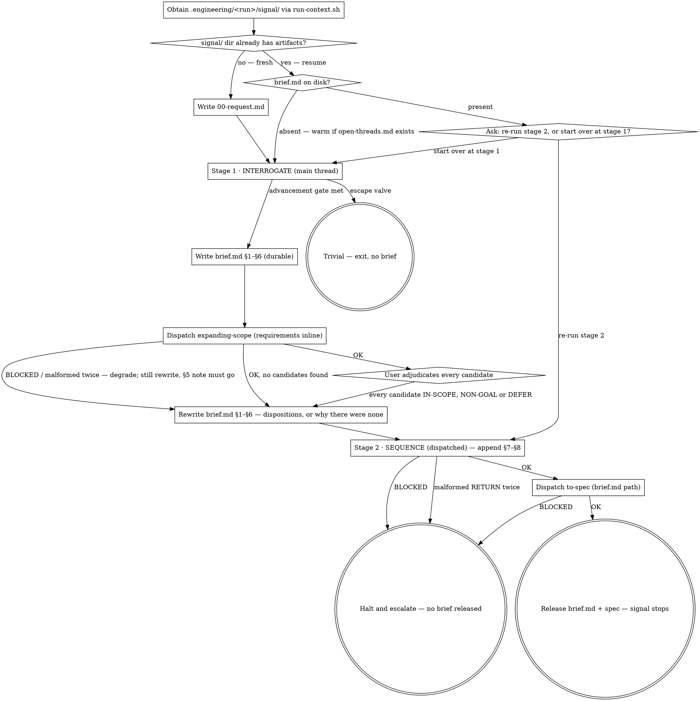

# Conducting Discovery

## Overview

The conductor for signal's two-stage discovery pipeline: **interrogate → sequence**. It owns control flow only — sequencing, dispatch, and enforcing order. Judgment lives in the skills it invokes: `engineering:interrogating-requirements`, `engineering:expanding-scope`, and `engineering:sequencing-requirements`.

It is **invoked explicitly** — by the `/signal` command, or by a direct request to "run signal" / "use the signal pipeline" on a request. It does **not** auto-intercept general "build X" requests; those go to `engineering:brainstorming` as usual.

Signal produces one artifact — `brief.md` — and stops at it: no review stage, no design stage, no plan stage, no build loop of its own. The one thing that happens after is mechanical, not a stage of signal's own: once the brief is complete, the conductor hands its path to `engineering:to-spec`, which renders the committed Tier-1 spec. Rendering a finished brief into the standard spec format is not designing, planning, or building — `to-spec` does none of those either — so this delegation does not reopen any of the three doors signal keeps closed.

**One artifact means one file, written by two hands.** Stage 1 writes `brief.md` §1–§6 in your thread; stage 2 appends §7 and §8 from a subagent. There is no intermediate requirements document, and no stage restates another stage's sections.

## The Iron Rule

**You are a router. Work happens in subagents, artifacts live on disk, and you pass paths.**

Three non-negotiables:

1. **Never read an artifact produced by a dispatched subagent.** Not `brief.md` §7, not §8. You route paths and act on RETURN blocks. Files **written in the main thread are yours to read** — `00-request.md`, and `open-threads.md`, which stage 1 writes in your own session. That is not an exception carved into this rule; it is what the rule has always said. The prohibition is on artifacts a *dispatched subagent* authored. `brief.md` is the one exception that predicate doesn't reach: even though you wrote §1–§6 in the main thread, the file — not the section — is the unit, and stage 2's §7–§8 live inside that same file, so the whole of it stays closed to you. Your context stays small and decision-grade — that is the entire point of the architecture, and it is worth more than your curiosity about any single file.
2. **Stage 1 is yours.** It is interactive, so it runs in the main thread and you write `brief.md` §1–§6 yourself. **This is the one exception, and it is not a licence to read the rest.** Writing sections from a conversation you were part of is not the same act as reading a file a subagent authored — and §7 and §8, which stage 2 appends to that same file, remain closed to you. Handing content *down* to a subagent — as you do when you dispatch `expanding-scope` with the requirements inline — is likewise not a violation: the rule governs what you read *back*.
3. **Signal stops at the brief.** No design, no plan, no build, no "and here's how I'd implement it".

### On rationalizing a read

You will be holding a path to a document you did not write, about a request you have been discussing with the user for twenty minutes. The pull to open it is real. Name it when it arrives, and refuse:

- *"Just to check it came out right"* — nothing checks it, by design. The brief is released to the user unreviewed and that trade was made deliberately. Opening it does not restore a check that no longer exists; it only costs you the context discipline. The user is the reader.
- *"The user asked me a question about the brief"* — report the path. If they want the brief discussed, they can open it, or start a fresh conversation with it as input. You answering from a brief you read is the failure mode, not the service.
- *"I only need one section"* — one section is a read. Rules with a size threshold have no threshold.
- *"I need it to write a good summary for the user"* — the summary is: here is the path, signal is done.
- *"I need to verify the subagent actually did the work"* — the RETURN block's `status` and `artifact` are the verification surface. A `BLOCKED` status is how a subagent tells you it didn't.
- *"I'm about to re-dispatch stage 2, I should know what changed"* — stage 2 re-reads its own inputs. You do not need to have read the prior brief to re-dispatch against it.

If you have read an artifact, say so plainly to the user rather than hiding it. A disclosed violation is recoverable; a silent one corrupts every downstream judgement you make.

## The RETURN Block Contract

**Every dispatch inherits the session model — signal never sets it, and there is nothing to configure.**

Every dispatched subagent returns at most 20 lines:

````markdown
```
status: OK | BLOCKED
artifact: <path>
actionable: <only what you must act on — nothing else>
```
````

The status vocabulary is exactly `OK` and `BLOCKED`. Nothing else is a valid status.

`actionable` carries decision-grade content only: expansion candidates awaiting adjudication, `sections_1_6_lines: <n>` from stage 2, or a `BLOCKED` reason. Those are the whole list. It never carries brief prose or reasoning. If there is nothing for you to act on, it is empty.

`artifact` carries a path, not content. One skill — `engineering:expanding-scope` — writes no file at all, and its `artifact` field carries no path; its `actionable` is its whole output. That is expected, not malformed.

A malformed RETURN block is handled per `## Error Handling`.

## Run Directory

Run artifacts live at `.engineering/<run>/signal/` in the **user's** project — never inside the plugin. `<run>` is not yours to name: obtain it by running `sh "${CLAUDE_PLUGIN_ROOT}/scripts/run-context.sh" signal <slug>`, which prints the absolute path of `.engineering/<run>/signal/` and creates it if needed. Signal is ordinarily the **first** phase to run, so this call is usually what creates `.engineering/.current-run` in the first place — the pointer that later phases (triage, design, plan, build) join rather than re-derive. If a run is already active, this same call joins it instead, and the slug you pass is ignored.

**Slug** — kebab-case, derived by you from the request in 2–4 words (`add-oauth-login`, `rework-billing-emails`), passed to `run-context.sh` only to seed a brand-new run. It has no effect once a run is active.

**If the directory `run-context.sh` returns already contains artifacts** — `00-request.md` or `brief.md` — report it and ask the user whether to **resume that run**, or, if this is a different request entirely, **supply a different slug** so `run-context.sh` can start it as a separate run instead of joining this one. A different slug only produces a different directory when no run is currently active — see above — so if a run is active, resuming is the only real option: say so, rather than offering a choice that will not do what it appears to. **Never silently overwrite a prior run's artifacts**, and never write into an existing run's `signal/` directory as though it were empty.

**What resume means.** There are two stages and one artifact, so resuming is a short table lookup:

| What is on disk | What you do |
|---|---|
| No `brief.md`, and `00-request.md` records a trivial exit | The request was already judged trivial and no brief was written. Say so, quote the recorded reason, and ask whether they want it interrogated properly this time — do not silently re-run the same judgement. |
| No `brief.md`, no `open-threads.md` | Stage 1, from the top. Nothing was learned before the run was abandoned, so the questions start again. |
| No `brief.md`, but `open-threads.md` exists | Stage 1, **warm**. The advancement gate was never met, but the work survived. Hand stage 1 the run directory as usual; its `## Returning Sessions` rules take over — it opens by offering the threads, honors the coverage table, and does not re-ask a dimension already recorded as `filled`. |
| `brief.md` exists | **Ask** the user: re-run **stage 2** against it, or start over at **stage 1**? Starting over at stage 1 rewrites the file from line 1 and discards any §7–§8 a previous run left, because that body was ordered from requirements about to be replaced. Starting over is still warm: `open-threads.md` survives a stage 1 restart, so the coverage table and the open threads carry across rather than being re-earned. Stage 2 then appends a fresh one. |

Read `00-request.md` freely — you wrote it. The prohibition is on artifacts a subagent authored.

The one question exists because `brief.md` looks the same to you whether stage 1 has just written §1–§6 or stage 2 has already appended §7 and §8 — and **you may not open it to tell those apart.** So do not infer, do not introduce a status marker, and do not carry state between runs. You are already in an interactive conversation; one question costs a single turn.

Take the user's answer and enter there. If they are unsure, stage 1 is the cheaper mistake: re-running stage 2 over a brief that has no §1–§6 produces nothing, while re-running stage 1 costs only time.

**Do not open `brief.md` to answer the question for them,** and do not ask a subagent to read it and report back — that is the same read with an extra hop.

Layout:

```
00-request.md            the raw request, verbatim (written by the conductor)
open-threads.md          working state — coverage table and loose ends (stage 1, main thread)
brief.md                 THE deliverable — §1–§6 by stage 1, §7–§8 by stage 2
```

Obtain the run directory via `run-context.sh` and write `00-request.md` yourself, with the request verbatim, **before anything else** — before triage, before the first question. If the user gave no request text, ask for it first; there is nothing to record otherwise.

This directory is what you supply to `engineering:interrogating-requirements`, which writes `brief.md` §1–§6 into it. Every path you hand to a dispatched subagent is inside this directory.

## Pipeline



### Stage 1 — Interrogate (main thread)

Invoke `engineering:interrogating-requirements`. **It runs in the main thread** because it interrogates the user interactively and a subagent cannot. Supply it the run directory — it writes its artifact there.

Do not proceed until its **advancement gate** is satisfied: at least 3 rounds of questioning, *and* every coverage dimension filled. Both. If the user pushes back hard, the skill's confirm-or-correct checklist is the path forward — not a quiet advance on assumptions.

**Escape valve.** If the request is genuinely trivial (one-liner, rename, config tweak), say so in one sentence and exit the pipeline. No brief. If in doubt, it is not trivial — interrogate.

Before you exit, **append a line to `00-request.md` recording the trivial exit and your one-sentence reason.** Otherwise the run directory is a request with no brief — byte-identical to a run someone abandoned halfway through an interrogation — and a later re-run under the same slug would re-interrogate a request you already judged trivial. `00-request.md` is your own file, not a subagent's artifact, so writing to it and reading it back breaks no rule.

**Write before expanding.** The moment the gate is met, stage 1 writes `brief.md` §1–§6 — before any dispatch. The interrogation is the most expensive thing this pipeline produces and the only part the user paid for in their own time; until it is on disk it lives in a conversation that any failure takes with it. Do not let the expansion beat run first on the reasoning that the brief would only have to be rewritten anyway. It does get rewritten, and that is cheap; losing the interrogation is not.

**Then the expansion beat.** `engineering:interrogating-requirements` owns it and specifies it in full — the three angles, the five-candidate cap, the single checklist, and how each disposition reaches §5. Follow it there; it is not restated here, so that there is one copy to change. What is yours is the control flow around it:

1. **Dispatch** `engineering:expanding-scope` with the requirements stage 1 just wrote, **inline in the dispatch prompt**. They are already in your context, so hand it the text rather than the path — it must never read `brief.md`, and giving it a path invites exactly that. Do send it something: a candidate proposed against nothing is a candidate already in scope.
2. **It writes no file.** Its `actionable` is its entire output and its `artifact` field carries no path. Do not wait for a file it will never produce.
3. **If it returns `BLOCKED`, do not halt the run — and note that this now costs almost nothing.** `brief.md` §1–§6 is already on disk, so a failed expansion loses five suggestions rather than an interrogation. Tell the user the beat failed and why, then go to step 4 anyway. This is still the one dispatch failure in the pipeline that degrades rather than stops. (A malformed RETURN gets one re-dispatch first, per `## Error Handling`; only a second failure degrades.) A return of `OK` with no candidates is not a failure — it found nothing worth proposing — and takes the same route.
4. **Then stage 1 rewrites `brief.md` §1–§6 in full**, per its own skill, replacing the first write rather than patching it. **This happens on all three paths** — candidates adjudicated, none proposed, or the beat failed — because the first write left §5 saying expansion had not run yet, and that sentence must not ship once it has been attempted. Where there were candidates, every one has a disposition and every disposition reaches §5.

Stage 1 ends with `brief.md` §1–§6 on disk and the line count of the **final** write in your hands.

### Stage 2 — Sequence (dispatched)

Dispatch `engineering:sequencing-requirements` as a subagent with two inputs: **the path to `brief.md`**, the file stage 1 just wrote, and the path to `open-threads.md`. Pass the `open-threads.md` path only if that file exists — on a resumed run predating this feature it may be absent, and stage 2 is told so rather than handed a path to nothing. It reads §1–§6 and appends to `brief.md`; it reads `open-threads.md` and never writes it.

It appends **§7 and §8 only**: the dependency-ordered body and the handoff pointer. It does not rewrite, re-word or reorder §1–§6, and neither do you. The finished brief reads in two voices — yours for the requirements, the subagent's for the body — and that is the intended shape, not a defect to smooth over.

It returns `status: OK` with `artifact` set to the brief's path and `actionable: sections_1_6_lines: <n>`. **You receive a path. Do not read it** — least of all now that two of its sections were written by a subagent.

**Check the count before releasing.** Stage 1 counted `brief.md`'s lines immediately after writing §1–§6 and handed you that number. Compare it to the one stage 2 reports:

- **Equal** — the boundary held. Go to `## Release`.
- **Different** — stage 2 altered sections it was forbidden to touch. **Halt and escalate**, tell the user which count you expected and which came back, and do not release. Do not open the file to see what changed — the mismatch is the finding, and the user can read their own brief.
- **You have no number to compare** — this is a **resumed run** where the user chose to re-run stage 2 against a `brief.md` written in an earlier session. Stage 1 did not run, so no baseline exists, and you may not open the file to reconstruct one. **The check is unavailable, not passed.** Say so explicitly at release: the brief is being handed over without the two-writer check, because the run that wrote §1–§6 is over. Do not treat stage 2's reported number as self-verifying — a number with nothing to compare it against proves nothing. If the user wants the check, starting over at stage 1 is what provides it.

Never silently skip this. An unavailable check that goes unmentioned reads exactly like a check that passed.

This is a tripwire, not a proof. It catches inserted or deleted lines and misses a re-wording that preserves the count, which is precisely why the rule in `engineering:sequencing-requirements` is written as an absolute prohibition rather than left to this check. Counting a number you already hold is not reading the artifact.

If it returns `status: BLOCKED` — contradictory requirements, a requirement section that is actually empty, or `brief.md` missing, unreadable, or missing §1–§6 — **§7 and §8 were not written.** Halt and escalate to the user with the reason from `actionable`. Do not retry silently, do not author §7 or §8 yourself, and **do not release the brief.**

A `BLOCKED` from stage 2 is usually stage 2 telling you something is wrong with *your* sections — it is forbidden from fixing §1–§6, so reporting is all it can do. Escalate with that reason and **stop there.** If the user decides to fix it, that is their call and the run re-enters at stage 1; you do not make that decision for them and you do not roll straight on into a rewrite. Never release a brief that stops at §6: there is no body, and §8 — the only section telling a reader what the document is for — is missing.

## Release

After stage 2 returns `OK` and the line count matches, release:

1. **Confirm the file is actually there** — `test -f <path>`, or an equivalent existence check. Nothing else. A subagent can return `OK` having written nothing, and reporting a path to a file that does not exist is the one failure the user cannot recover from without starting over. **Checking existence is not reading content**: the Iron Rule governs what you read out of the file, not whether you confirm it exists. If it is missing, halt and escalate — do not release a phantom path.
2. **Dispatch `engineering:to-spec` with the path to `brief.md`.** Signal does not write a spec itself — `to-spec` is the plugin's sole writer of Tier-1 specs, and this is the hand-off: the finished, adjudicated brief, path only, exactly as you hand `brief.md`'s path to stage 2. You do not read `brief.md` to make this dispatch and you do not read it afterward either; `to-spec` reports back the path of what it wrote under `docs/dashworthy/engineering/specs/`. If it refuses or reports a failure, halt and escalate with its reason — do not write a spec yourself and do not fabricate a path.
3. Report both paths: `brief.md` — the Tier-2 record, under `.engineering/<run>/signal/` — and the spec `to-spec` wrote — the Tier-1 deliverable, under `docs/dashworthy/engineering/specs/`. Paths, not contents, for either.
4. If `open-threads.md` has any unchecked thread, report its path too, with the count — "4 threads still open". You may read it to get that count; stage 1 wrote it in your own session. Do not summarise what the threads say; the count and the path are the handover.
5. State plainly that signal's job is done: the spec is the input to whatever comes next — ordinarily `writing-plans`, a human, or another pipeline — with `brief.md` behind it as the Tier-2 record.
6. Stop.

**Do not read the brief and do not summarise it.** You have never seen §7 or §8 and you do not open them now to describe what you are handing over. The path is the handover. Dispatching `to-spec` with that path is not an exception — you hand it over unread, the same way you hand it to stage 2.

**Do not offer to implement it.** Do not sketch an approach, propose a first step, estimate effort, or say "want me to start on §7?". Signal makes no claim about what happens next, and neither do you. If the user wants to build from the brief or the spec, that is a new conversation with one of them as input.

If the pipeline ran **inline** because subagent dispatch was unavailable, say so at release — see `## Error Handling`.

## Error Handling

| Situation | Behaviour |
|---|---|
| Trivial request | Stage 1 escape valve — say so, exit, no brief |
| `engineering:sequencing-requirements` returns `BLOCKED` | Halt and escalate with the reason. No brief released. |
| `engineering:expanding-scope` returns `BLOCKED` | **Degrade, do not halt.** `brief.md` §1–§6 is already on disk, so this costs the suggestions and nothing else. Say so, and let stage 1 rewrite §1–§6 as it does on every path — §5 must record that expansion was attempted and failed, not that it has not run. Then stage 2. |
| `engineering:expanding-scope` returns `OK` with no candidates | Not a failure. Same route as above: stage 1 rewrites, §5 records that the beat ran and found nothing. |
| Stage 2 reports a `sections_1_6_lines` count that differs from the one stage 1 handed you | Halt and escalate — the two-writer boundary was crossed. Do not release, and do not open the file to investigate. |
| No baseline count exists (resumed run, stage 1 did not run) | The check is unavailable, not passed. Release only after saying so explicitly. |
| Subagent returns a malformed RETURN block | Re-dispatch once with the contract restated. On a second failure: halt for stage 2, degrade for `expanding-scope`. |
| `brief.md` missing at release despite `status: OK` | Halt and escalate. Never report a path to a file that is not there. |
| `engineering:to-spec` refuses or reports failure | Halt and escalate with its reason. Do not write the spec yourself and do not release a path to one that does not exist. |
| User abandons mid-run | Artifacts remain on disk. **Stage 1 writes `brief.md` §1–§6 as soon as the advancement gate is met**, so an interrogation that got that far survives — what is on disk is a real brief whose §5 says scope is unsettled. Abandoned before the gate, `open-threads.md` survives with whatever coverage and threads stage 1 had banked, so the next run resumes warm rather than cold. Only a run abandoned before the first answer leaves nothing but `00-request.md`. Say which of the three happened rather than letting the user guess. |
| No web/subagent capability | Signal requires subagent dispatch. If unavailable, run each stage inline in the main thread and say so — degraded context purity. |

**On the no-subagent case:** running inline is a degradation you announce, not a silent fallback. Tell the user that context purity is degraded because the work is running in your thread. Never let a missing subagent capability skip a stage — a skipped stage is a worse failure than a dirty context. Stages 1 and 2 produce the same artifacts inline; only your context suffers.

**On a malformed RETURN block:** re-dispatch means dispatching the same skill again with the RETURN contract restated verbatim. It does not mean guessing what the subagent meant, and it does not mean opening the artifact to work it out for yourself.

## Red Flags — STOP

- Reading `brief.md` §7 or §8 — the sections stage 2 wrote — for any reason, including "just to check it" and "to work out which stage a resumed run is at". On a resumed run you **ask**; you do not open the file.
- Summarising the brief to the user at release instead of reporting its path.
- Designing, planning, or building after release.
- Overwriting an existing run directory without asking.
- Dispatching stage 1 as a subagent — it is interactive.
- Advancing out of stage 1 with an unadjudicated expansion candidate, or writing §5 with a candidate missing from all three of its lists. Every candidate is IN-SCOPE, NON-GOAL or DEFER, and every one leaves a trace in §5 — a deferred one leaves a second trace in `open-threads.md`.
- Advancing out of stage 1 with a filled coverage dimension that reached no section — §6 Existing Context above all.
- Writing, editing or drafting §7 or §8 yourself, at any point, including "just to unblock stage 2".
- Releasing a brief after a `BLOCKED` from stage 2.
- Releasing without confirming `brief.md` exists, or releasing when stage 2's `sections_1_6_lines` count differs from the number stage 1 handed you.
- Releasing a resumed run without saying the two-writer check was unavailable, or treating stage 2's reported count as verified when there is no baseline to compare it against.
- Opening `brief.md` to investigate a line-count mismatch. The mismatch is the finding; escalate it.
- **Halting the run because `engineering:expanding-scope` returned `BLOCKED`.** That one degrades — say so, record no candidates, and write §1–§6. Every other dispatch failure halts; this one does not.
- Exiting through the escape valve without recording the trivial exit in `00-request.md`.
- Dispatching `engineering:expanding-scope` before stage 1 has written `brief.md` §1–§6. The write comes first — that ordering is what makes a failed expansion cheap.
- Going to stage 2 with §5 still saying expansion has not run. It has — successfully, emptily, or not at all — and §5 must say which. The rewrite is not conditional on candidates existing.
- Telling a user that a resumed run picks up where they left off when neither `brief.md` nor `open-threads.md` exists. It does not; that run never reached the advancement gate and banked nothing, so the questions start again. With `open-threads.md` on disk the opposite holds — see the warm-resume row above.
- Inferring a resumed run's stage from what is on disk instead of asking the user.
- Treating `open-threads.md` as off-limits. Stage 1 wrote it in your session; it is a main-thread file like `00-request.md`, and refusing to read it breaks warm resume for no gain.
- Reading `open-threads.md` and then summarising the threads to the user at release. Report the path and the count.
- Telling the user a pre-gate run was lost when `open-threads.md` is on disk. It was not.
- Writing the spec yourself instead of dispatching `engineering:to-spec`. Rendering the Tier-1 document is that skill's job, not yours, even though it is mechanical.
- Releasing without dispatching `engineering:to-spec`, or releasing only `brief.md`'s path when the spec dispatch has already returned a path of its own.
- Reading `brief.md` to check `to-spec`'s work, or to decide whether it is "ready" to hand over. The dispatch is the same unread hand-off as stage 2's.

Every one of these means: stop, and route the path instead.

## Common Mistakes

| Mistake | Fix |
|---|---|
| Reading the brief to answer a user question about it | Report the path. If they want it discussed, they can open it or start a new conversation with it. |
| Making stage 1 a subagent | It is interactive — keep it in the main thread. |
| Continuing into implementation after release | Signal ends at the brief and its spec. Hand off. |
| Waiting for a file from `expanding-scope` | It writes none. Its `actionable` is the whole output; the dispositions go straight into `brief.md` §5. |
| Adjudicating expansion candidates yourself | The user adjudicates. You relay one checklist and record the answers. |
| Opening `brief.md` on a resumed run to see how far it got | Ask the user which stage to pick up at. One question, no state, no read. |
| Writing the spec by hand | Dispatch `engineering:to-spec` with `brief.md`'s path. It is the only writer of Tier-1 specs. |
| Tidying stage 2's §7 so the brief reads in one voice | Two writers, two voices. That is the design. |
