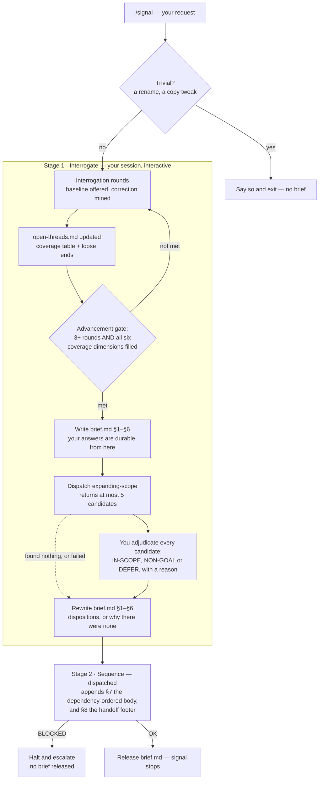

# signal

Discovery, and only discovery. `signal` turns a vague request into one dependency-ordered brief — then stops and hands it off.

## Install

```
/plugin marketplace add https://github.com/dashworthy/development-skills
/plugin install signal@dashworthy
```

The marketplace namespace is `dashworthy`, but it does not appear in skill IDs. Once installed, signal's skills are addressed as `signal:*` — for example `signal:conducting-discovery` — never `dashworthy:*`.

## Usage

```
/signal add oauth login to the admin app
```

Here is what to expect, honestly:

- **An interrogation you must actually answer.** signal will not hand off on a vague request. It asks one question at a time, and it asks by offering you the **conventional answer** — what most people in your position would do, with its reasoning visible — and inviting you to correct it. Agreeing is cheap and moves things along; correcting it is where the real requirements come from, and every correction gets mined for the reason behind it. It will not advance until it has run at least 3 rounds *and* filled all six coverage dimensions (problem, users, success criteria, constraints, scope boundaries, existing context). "Whatever makes sense" is not an answer it accepts. If your request is genuinely trivial — a rename, a config tweak — it says so in one sentence and exits without producing a brief; otherwise, budget for a real back-and-forth.
- **A session you can end whenever you like.** Signal writes `open-threads.md` as it goes: a coverage table of what is established, and a list of what it noticed and did not chase. Ending early does not lose the interrogation — the next run opens by offering you those threads, and never re-asks a dimension already banked. The gate is unchanged, so no brief ships until the six dimensions are genuinely filled; what changes is that getting there can take two sittings instead of one.
- **An expansion checklist.** Once the dimensions are filled, signal dispatches a subagent to propose up to 5 things you never thought to ask for — an adjacent capability, a bigger framing, something undervalued in what you scoped. You accept, reject, or defer each one in a single round. Nothing reaches the brief undecided: what you accept is written in as a requirement, what you reject is written into the non-goals list with your reason, and what you genuinely cannot call yet is deferred — named in the brief and opened as a thread in `open-threads.md`, so it is tracked rather than fudged into a rejection. If that subagent fails, signal says so and carries on without candidates — a narrower brief, not a lost interrogation.
- **A brief, once the above is settled.** Written to `.signal/runs/<date>-<slug>/brief.md` — your answers as §1–§6, then a dependency-ordered body and a handoff pointer appended as §7–§8. It is released to you as soon as it is written; nothing reviews it first, and the only check on it is the interrogation that produced it.

Then signal stops. It does not offer to build the thing.

## The two stages

There is **one artifact — `brief.md` — and it has two writers.** Stage 1 writes §1–§6, stage 2 appends §7 and §8, and neither rewrites the other's sections. There is no intermediate requirements file.



The expansion beat is the part people miss. It runs *before* the requirements are written down, because "what else could this be?" is scope definition while you're still in the room and scope creep once the brief exists. Every candidate must resolve one way or the other — nothing reaches the brief undisposed.

| Stage | Runs where | Produces |
|---|---|---|
| 1. Interrogate | Main thread (interactive) | `brief.md` **§1–§6** — one section per coverage dimension, written straight into the deliverable: §1 Problem, §2 Users & Stakeholders, §3 Success Criteria, §4 Constraints, §5 Scope, §6 Existing Context. Every expansion candidate is resolved into §5's in-scope list or its non-goals with your reason. Includes the scope-expansion beat: a dispatched `signal:expanding-scope` subagent is handed the draft requirements inline and proposes candidates in its return value only — it writes no file. Written once, after adjudication, already complete. |
| 2. Sequence | Dispatched subagent (`signal:sequencing-requirements`) | `brief.md` **§7–§8**, appended — §7 The Work, In Dependency Order (ordered so nothing appears before what it depends on) and §8 How to Consume This Brief. It reads §1–§6 and `open-threads.md`, and edits neither; if it thinks a requirement section is wrong it returns `BLOCKED` rather than fixing it. |

Because the brief is one file in two states, a **resumed** run does not guess. If `brief.md` is absent, signal starts at stage 1. If it exists, signal asks whether to re-run stage 2 against it or start over at stage 1 — it does not read the brief to work that out for itself.

## What signal does not do

- **No design, plan, or build stage.** The brief is the whole deliverable, and signal reports its path and stops. It will not sketch an approach, propose a first step, or ask "want me to start on §7?".
- **It does not split work into buildable units.** §7 orders the work by dependency — what has to be understood before what, and why. That is a description of the problem's shape, not a plan of attack and not a backlog. Deciding how to slice the work is a design judgement belonging to whoever picks the brief up.
- **Nothing checks what the brief says.** There is no third stage and no automated second opinion on its content; it is released exactly as stage 2 leaves it. The interrogation is the only scrutiny it gets — so signal never tests whether the finished brief stands on its own to a reader who was not in the room. That is a deliberate trade, and reading the brief yourself is what replaces it. Two structural checks do run before release, and neither reads a word of it: the file must actually exist, and stage 2 must report the same §1–§6 line count stage 1 wrote, so a subagent that edited the requirements sections it was forbidden to touch halts the release instead of shipping.
- **No configuration.** No config file, no thresholds, no per-stage model selection. Dispatched subagents inherit whatever model your session is running.
- **No hooks and no code** — four skills and one command, all prose. No documentation system, no templates, and no prior-art, reuse or abstraction analysis; those belong to whatever builds from the brief.

Once you have a brief, the natural next step per component is `superpowers:brainstorming` (or a human, or whatever pipeline you use to get from a brief to working code). signal makes no claim about what happens next and doesn't try to.

## Run artifacts

Every run writes to `.signal/runs/<YYYY-MM-DD>-<slug>/` in **your project**, not inside the plugin:

```
00-request.md            the raw request, verbatim (written by the conductor)
open-threads.md          working state — the coverage table and what is still unresolved
                         written continuously during the interrogation, by stage 1
brief.md                 THE deliverable — unnumbered so it is trivially findable
                         §1–§6 written by stage 1, §7–§8 appended by stage 2
```

`.signal/runs/` is ordinary project content — commit it or gitignore it, whichever fits how your team likes to keep (or discard) discovery history.

**Your answers are on disk as soon as the interrogation finishes.** Stage 1 writes `brief.md` §1–§6 the moment the advancement gate is met — before the expansion beat, before any subagent runs, before anything can fail. It then rewrites those same sections after you adjudicate, folding the dispositions in. Same file, same writer, second write replaces the first. The reason for the early write is blunt: the interrogation is the part that cost *you* time, and until it is written down it exists only in a conversation that a crash or a failed dispatch takes with it. Everything after it is cheap to redo.

**Re-running against an existing run.** If the directory already exists, signal asks whether to resume it or start fresh under a `-2` suffix; it never silently overwrites. Resuming with a `brief.md` present means choosing whether to re-run stage 2 against it or start over at stage 1 — signal asks rather than inspecting the file, because it is not allowed to read it. If there is no `brief.md`, the earlier run never reached the advancement gate — but `open-threads.md` will usually still be there, so resuming picks up the coverage table and the open threads instead of starting cold. Only a run abandoned before the first answer leaves nothing to resume from. And a request that exited through the trivial escape valve is recorded as such in `00-request.md`, so re-running the same slug tells you it was already judged trivial instead of quietly asking again.


## License

MIT. See [LICENSE](../LICENSE).
